# 這是LOL中ARAM場的筆記

+ ## 一些建議
  + ### 法師是否出門裝出法球
        主要是看是否需要吃傷害，像烏鴉、血鬼這種就買，若是長手丟丟怪就不需要
  + ### 召喚師技能選擇
    
  + ### 團員構成
        傷害均衡(2AD或3AD)，資源分配合理(發育的英雄不要太多)
        6級前掛機英雄最多2個
        硬控不能太少
        要選戰士的話，最好隊伍要有其它的戰士/坦克，盡量不要單選戰士(劍聖除外)
  + ### 血包
        血包是回復比例的血值，血會少的當然回血越多，血包跟光圈有差異
        假設滿血為100%，當前生命為x%(0< x < 100)
        光圈回血量為(100 - x) * 16%
        血包+光圈回血量為(100 - x) * 8% + [ 100 - (100 - x) * 8% - x] * 16%
        兩者差距為6.72% * (1 - x%)的最大生命值
  + ### 站位
    **若隊友沒有一開始就出來，就站在一血包的前面一點點就好，如下圖**
    
    + #### 分散(適用於對方有團控的陣容)
          不要和你的主C站在一起，易買一送一
          殘局若一定會死的情況下選擇反跑，避免被敵方利用做進場的跳板
    + #### 抱團(適用於對面針對單體的陣容)          
          靠近你的主C，第一時間準備好控制、虛弱、點燃
          保護主C或幫擋技能 
  + ### 雪球
          有兩段機制
          第一段打中目標才會有第二段
          第二段為位移至命中目標身邊
          傷害為15-100(隨等級提升)的真實傷害

+ ## 漢默丁格(泡麵頭、大頭)
  + ### 天賦
    
  + ### 召喚師技能
    
  + ### 出門裝
        
  + ### 出裝
    
   + ### NOTE
          主Q副W

          連招
          E(到人)-Q-W
          E-A-W
          E-A-R-W
          R-Q-E-W

+ ## 布蘭德(火男)
  + ### 天賦
    
  + ### 召喚師技能
    
  + ### 出門裝
    
  + ### 出裝
    
  + ### NOTE
        主W副Q

        E是會擴散的，正確用法是向兵線丟W，再對W到的小兵丟E形成擴散
        要注意E跟R只會擴散鄰近一個的敵人，所以一直線的敵人中丟中間的那位E會比較划算

        連招
        W-E-R

+ ## 卡特蓮娜
  + ### 天賦
    
  + ### 召喚師技能
    
  + ### 出門裝
        
  + ### 出裝
    
  + ### NOTE
        可AD可AP，AD容錯較高，若本團沒AP在出AP

        被動是3秒內殺死敵方英雄可以-15秒CD

        Q、E都要點在敵方身上

        AP卡特
        主Q副E

        AD卡特
        主E副Q

        連招
        Q-E-A，Q丟出刀後，滑鼠指向刀落地點按E，卡特即會飛過去刀的落地點並砍

        Q-E-W

        Q-E-W-R(好用)
        不用管E有沒有撿到Q的刀，反正R結束後還可以再撿

        基本上大絕要配合Q-E進場或者其他方式進場到中央
        R前一定要放W，會比較順

+ ## 好運姐(女槍)
  + ### 天賦
    
  + ### 召喚師技能
        
  + ### 出門裝
    
  + ### 出裝
    
  + ### NOTE
        主E副Q
        如果敵方英雄站小兵後面，Q小兵

        E-R連招

+ ## 卡爾瑟斯(死哥)
  + ### 天賦
    
  + ### 召喚師技能
    
  + ### 出門裝
            
  + ### 出裝
    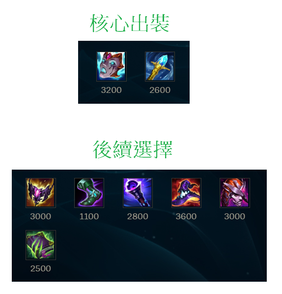
  + ### NOTE
        主E副Q

        先攻死哥
        一定要讓大招觸發先攻(要注意對方是否人都活著)
        開團，雪球打到小兵或人後，開E飛過去觸發先攻

+ ## 艾希(寒冰、IC)
  + ### 天賦
    
  + ### 召喚師技能
    
  + ### 出門裝
        
  + ### 出裝
    
  + ### NOTE
        主W副E

        R飛到對方泉水的時間
        己方泉水 8秒
        己人第一血包處 5秒
        敵人第一血包處 4秒
        敵人第二血包處 3秒

+ ## 弗拉迪米爾(吸血鬼)
  + ### 天賦
    
  + ### 召喚師技能
    
  + ### 出門裝
    
  + ### 出裝
    
  + ### NOTE        
        主Q副E

        E技能改手動施法

        Q兵吸血，補兵，Q兩次以後，會自動在2秒後強化Q，底下也會是紅條
        可以利用觸發相位猛衝讓敵方吃紅Q
        W撞到敵人可緩速敵人
        E會耗血的攻擊，所以千萬別用E吃兵

        連招

        雪球-E-W(要常用，但要在有相位的時候用)
        雪球過去，EW一套打完就回來

        E-R-Q-W
        先開E續力，雪球或閃現過去敵方，讓敵方吃二段E的傷害，迅速開R後Q，W離開戰場

        E-Q
        先開E續力，調整E的範圍，然後再E自動爆開以前對敵方按Q，Q是能提前讓E自動爆開的

+ ## 希格斯(炸彈人)
  + ### 天賦
    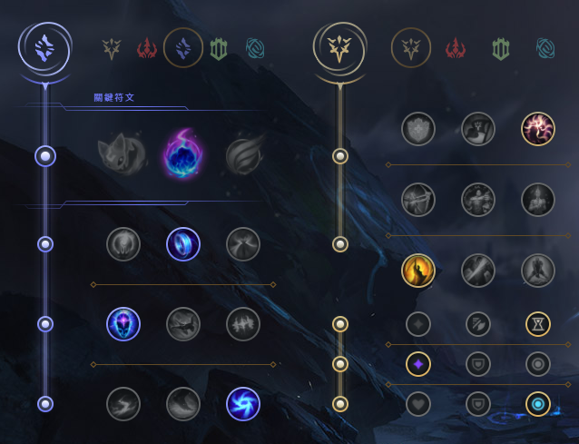
  + ### 召喚師技能
    
  + ### 出門裝
        
  + ### 出裝
    
  + ### NOTE        
        主Q副E

+ ## 葛雷夫(男槍)
  + ### 天賦
    
  + ### 召喚師技能
    
  + ### 出門裝
    
  + ### 出裝
    
  + ### NOTE
        主Q副E

        換彈的期間E-Q
        Q可以打牆，彈道牆附近敵人造成傷害

        沒牆就用煙霧彈輔助Q的命中

        這隻腳色就是要不斷的走位、走位再走位
        因為主要輸出還是要靠平A

+ ## 阿璃(狐狸)
  + ### 天賦
    
  + ### 召喚師技能
    
  + ### 出門裝
        
  + ### 出裝
    
  + ### NOTE
        主Q副W

        連招
        E-Q-W

        準頭不夠就出永霜
        出招順序
        永霜 -> E

+ ## 科加斯(大蟲子)
  + ### 天賦
    
  + ### 召喚師技能
        
  + ### 出門裝
    
  + ### 出裝
    
  + ### NOTE
        主Q副W

        大招可以先吃兵就吃兵疊層數，不一定要等到吃英雄

+ ## 茂凱(大樹)
  + ### 天賦
    
  + ### 召喚師技能
        
  + ### 出門裝
        
  + ### 出裝
    
  + ### NOTE
        主E副Q

        不要當坦
        盡量往草叢邊緣丟E，不然容易被小兵碰到
        E是主要輸出手段，只要沒兵線的情況下，E就直接丟敵方位置

+ ## 剛普朗克(船長)
  + ### 天賦
    
  + ### 召喚師技能
        
  + ### 出門裝
    
  + ### 出裝
    
  + ### NOTE
        6級前主Q
        6級後主E
        用Q搶頭搶砲車
        R改手動施法

        小招升級由左到右即可

        連桶重點不是要刻意去量桶子，而是你跟敵人間的距離
        平A二連桶基本上就是第一個桶子會在自己的腳下，第二個桶子會在敵人的腳下
        所以是要看你跟敵方的距離，你覺得二連桶能不能炸到為主
        然後第二個桶子可以放在第一個桶子的範圍與敵人間的中間點

        在ARAM的場地裡面，場地的寬剛好可以連成三個桶，也就是依照中線為主，大概觀測一下角度偏移量
        場地橫斜向三連桶好用
        草叢放第一桶等變一格，中線放第二個桶子後，Q草叢桶子，立馬在右線放第三個桶子，完成三連桶
        因為，場地寬就是可以三連桶成立，所以先在草叢藏桶，放第二桶子後立即Q第一桶子再放第三桶子

        二連桶
        13級前 E-A-E-Q
        要先A桶子一下
        然後盡量第一個桶子放自己身邊

        13級後可以EEQ

        3連桶以上是可以在Q桶之後瞬間擺新桶一起爆炸的(連桶爆炸有時間差)，但是要注意桶子的庫存還有手速要快
        2連桶建議確定擺上新桶後瞬間點第一個桶引爆
        2連桶也是可以打第一個桶子再放第二個桶引爆，但手速跟位置要快，不然很容易沒引爆到
        建議還是平A 2連桶
        炸桶子會刷新被動火刀的CD

        連招
        先用火刀A人，炸桶子，再A人跟Q

        Q二連桶(最好在13級後再用)
        第一個桶子要遠離自己，迫使一定要走過去Q，接著等抬手的瞬間在新的位置放桶

        感覺ARAM裡面橫的連桶，或斜的連桶比較好炸到人

+ ## 凱莎
  + ### 天賦
    
  + ### 召喚師技能
        
  + ### 出門裝
    
  + ### 出裝
    
  + ### NOTE
        主Q副W

        先合成魔宗進化Q    

+ ## 蓋倫
  + ### 天賦
    
  + ### 召喚師技能
    
  + ### 出門裝
            
  + ### 出裝
    
  + ### NOTE
    主Q副E

+ ## 易大師(劍聖)
  + ### 天賦
    
  + ### 召喚師技能
    
  + ### 出門裝
        
  + ### 出裝
    
  + ### NOTE
        主Q副E
        最後一定是這6件裝，只是順序可變
        第一件一定出破敗
        第二件出智慧末刃或死舞，看對面陣容
        第三件

        連招
        E-Q

+ ## 希瓦娜(龍女)
  + ### 天賦
    
  + ### 召喚師技能
    
  + ### 出門裝
    
  + ### 出裝
    
  + ### NOTE
        AP龍女
        主E副W

        AD龍女
        主E副Q

        不管是哪個龍女，基本上都還是靠大招後才行

        ARAM中龍女有多一個被動
        敵方砲車死亡自動加層數
        血包要吃敵方的才會加層數

        AD龍女
        先E中敵人在Q

+ ## 燼
  + ### 天賦
    
  + ### 召喚師技能
        
  + ### 出門裝
    
  + ### 出裝
    
  + ### NOTE
        主Q副W

+ ## 藍寶
  + ### 天賦
    
  + ### 召喚師技能
    
  + ### 出門裝
    
  + ### 出裝
    
  + ### NOTE  
        主Q 副E
        R改手動施法

        燒到一半按金人還是會繼續燒
        Q在燒人的時候放E不會中斷燒人

        連招
        50度左右WQE，追擊紅溫平A+E

+ ## 魔甘娜
  + ### 天賦
    
  + ### 召喚師技能
    
  + ### 出門裝
        
  + ### 出裝
    
  + ### NOTE
        主W副Q

+ ## 魔鬥凱薩(鐵男)
  + ### 天賦
    
  + ### 召喚師技能
    
  + ### 出門裝
           
  + ### 出裝
    
  + ### NOTE
        主Q副E

        抗性裝備也可以考慮出深淵面具
        先E再R鎖地形

+ ## 泰達米爾(蠻王)
  + ### 天賦
    
  + ### 召喚師技能
    
  + ### 出門裝
          
  + ### 出裝
    
  + ### NOTE
        主Q副E

        Q主要是被動有加攻擊力，團戰盡量不要拿Q去補血，因為怒氣能增加暴擊率

        W等敵方背對你時再用能緩速他

        要注意敵方若有蒐集者的話，血量要多留點開大    

+ ## 伊澤瑞爾(EZ)
  + ### 天賦
    
  + ### 召喚師技能
    
  + ### 出門裝
            
  + ### 出裝
    
  + ### NOTE    
        主Q副E

        W佛系攻擊，沒中沒差

        連招
        E-Q-A
        E-W-Q-A
        E人臉Q中，走回來，但要先注意敵方位置

        R飛到對方泉水的時間
        己方泉水 14秒
        己人第一血包處 6秒
        敵人第一血包處 5秒
        敵人第二血包處 4秒

+ ## 斯溫(烏鴉)
  + ### 天賦
    
  + ### 召喚師技能
        
  + ### 出門裝
    
  + ### 出裝
    
  + ### NOTE
        主Q副W

        主要是多多累積被動
        W、E每弄到一名敵方英雄會提供1層
        每一名敵方英雄陣亡會提供1層

        E-W連招(注意: W有2.5秒才會爆掉，所以二段E不能太急著按)
        先用第一段的E -> 如果有抓住敵人，再敵人離你的路徑中放W(也可放在敵人腳下)，接著再二次E抓回來讓敵人吃W
        E是彈出去抓，還會彈回來，來回彈到敵人才能將敵人抓回來
        個人覺得等W的眼睛出現再按二段E就好

        回血
        疾跑 + E
        腳下W + 金人

+ ## 達瑞斯(諾手)
  + ### 天賦
    
  + ### 召喚師技能
    
  + ### 出門裝
    
  + ### 出裝
    
  + ### NOTE
        需要不斷拉扯，盡量疊好血怒或殘局再出去
        移速、韌性、坦度是達瑞斯在ARAM中最重要的幾個屬性
        Q跟A擊中敵人會疊被動
        被動5層滿
        主Q副E

+ ## 索拉卡(奶媽)
  + ### 天賦
    
  + ### 召喚師技能
        
  + ### 出門裝
    
  + ### 出裝
    
  + ### NOTE
        主W副E
        還沒出好戰者之前，不要奶的太激進，盡量賺錢
        E技能主要是防守、封走位、限制突進
        E蠻適合對方刺客雪球到自家C位時，腳下放E

+ ## 維迦(小法)
  + ### 天賦
    
  + ### 召喚師技能
    
  + ### 出門裝
    
  + ### 出裝
    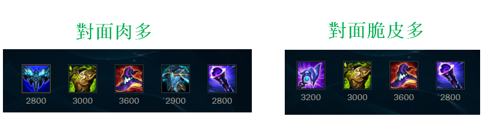
  + ### NOTE
        主Q副E

+ ## 塔莉雅(岩雀)
  + ### 天賦
    
  + ### 召喚師技能
        
  + ### 出門裝
    
  + ### 出裝
    
  + ### NOTE
        主Q副E
        Q、W取消自動施法
        W選擇敵方腳下，按住滑鼠左鍵選擇方向放開
        連招
        W-E-Q(一定要等W開始動作在接EQ)

        受傷時不能放R

+ ## 趙信
  + ### 天賦
    
  + ### 召喚師技能
    
  + ### 出門裝
    
  + ### 出裝
    
  + ### NOTE
        主W副Q

        積極A兵回血
        沒有大招只能後上，有大招才有先進場能力
        E-R開團

+ ## 納瑟斯(狗頭)
  + ### 天賦
    
  + ### 召喚師技能
    
  + ### 出門裝
    
  + ### 出裝
    
  + ### NOTE
        主Q副W

        Q兵，Q兵，Q兵
        尤其是砲車
        用雪球丟炮車，搶砲車，搶砲車，搶砲車
        隊友打團，放個E意思意思一下，專心Q兵
        盡量心無雜念專心Q兵疊到200層以後再打人

+ ## 圖奇(老鼠)
  + ### 天賦
    
  + ### 召喚師技能
    
  + ### 出門裝
    
  + ### 出裝
    
  + ### NOTE
        主E副Q
        Q主要是跑去後面偷後排
        潛行者之爪主要是拿來做位移調整位置的

+ ## 費德提克(稻草人)
  + ### 天賦
    
  + ### 召喚師技能
    
  + ### 出門裝
    
  + ### 出裝
    
  + ### NOTE
        主Q副E

        不要頂著對面的輸出去吸血
        目前吸血效果被削弱，不要指望

        注意:只有Q技能可以觸發冰川增幅，其餘的都不能

        草人的插眼是四號格，所以要趕快把普羅的飼料用掉

+ ## 犽凝(永恩)
  + ### 天賦
    
  + ### 召喚師技能
    
  + ### 出門裝
    
  + ### 出裝
    
  + ### NOTE
        主Q副E
        非常依賴閃現的英雄
        連招
        EQ閃接R 開團切入
        W閃Q 收拾殘局進行收割
        殘局盡量不要用閃現逃跑
        常見打法
        用Q疊風(Q中敵人兩次後，Q會變成風型態)
        Q打小兵也可以疊
        再打EQ或EQ閃接R

+ ## 黛安娜(皎月)
  + ### 天賦
    
  + ### 召喚師技能
    
  + ### 出門裝
    
  + ### 出裝
    
  + ### NOTE
        主Q副W

        連招
        Q-E會刷新E，QE可以同時按，滑鼠指向敵方同時按QE
        Q-E後穿插A來觸發被動
        可R閃

+ ## 睿娜妲
  + ### 天賦
    
  + ### 召喚師技能
    
  + ### 出門裝
    
  + ### 出裝
    
  + ### NOTE
        主E副W

        給隊友加頓的大號風女、大號露露
        陣容有ADC才適合睿娜妲出場，專養ADC的

        W主要用途是給隊友加攻速跟移速，所以隊友要輸出時就給
        盡量不要只把W當救命技能
        Q在把敵人拉回來的途中如果有撞到其他敵人則會暈眩
        R也可以在ADC輸出時放ADC前面保障ADC的安全

+ ## 貝爾薇斯(虛空女皇)
  + ### 天賦
    
  + ### 召喚師技能
    
  + ### 出門裝
    
  + ### 出裝
    
  + ### NOTE
        主E副Q
        目前還是當坦克玩，沒啥輸出

+ ## 捷莉(澤麗)
  + ### 天賦
    
  + ### 召喚師技能
    
  + ### 出門裝
        
  + ### 出裝
    
  + ### NOTE
        主W副Q
        E改成手動施法
        W在如果貼著障礙物可穿牆並變大範圍
        ARAM中W是蠻好用的一個招式
        W射障礙物途中不能有敵方小兵或敵人，不然會被阻擋

        中間一草的牆壁可以直接W到二草
        中間的牆壁缺口也可以用
        如果要從草叢打向血包處要用特殊技巧
        往後靠牆E，然後鼠標指向血包按W，一定要長得E
        基本上就是長距離的移動靠牆可以用W強化

+ ## 塔隆(男刀)
  + ### 天賦
    
  + ### 召喚師技能
    
  + ### 出門裝
    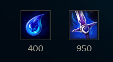
  + ### 出裝
    
  + ### NOTE
        主W副Q
        主要就是快速疊滿三層印記打出效果
        先手丟W，等W飛回來後，敵方身上掛兩層被動
        再用Q去打第三層被動

        連招
        W-R-Q-A
        要注意連招的R一定要刮到，這樣才可以到三層被動

+ ## 墨菲特(石頭人)
  + ### 天賦
    
  + ### 召喚師技能
        
  + ### 出門裝
    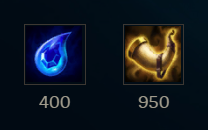
  + ### 出裝
    
  + ### NOTE
        主Q副E

        R改手動施法

+ ## 悟空(猴子)
  + ### 天賦
    
  + ### 召喚師技能
    
  + ### 出門裝
    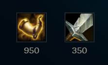
  + ### 出裝
    
  + ### NOTE
        主Q副E

        玩猴子一定要普攻AAAAA

        連招
        E-Q-R-W-Q-二段R
        雪球-Q-R-W-Q-二段R

+ ## 蒙多醫生
  + ### 天賦
    
  + ### 召喚師技能
    
  + ### 出門裝
    
  + ### 出裝
    
  + ### NOTE
        主Q副E
        蒙多醫生是左手丟斧頭，角度要喬一下
        丟斧頭可以只點自己與目標之間的路徑即可
        被動可以抵擋一次控制技能，被動觸發會掉藥劑，記得撿起來
        注意:敵方也可以撿藥劑
        W為爆發傷害，W開啟W關閉，最多4秒，CD長，耗損自身5%生命值
        W要貼敵方臉的時候再用
        E使用時會增加50的攻擊距離

+ ## 薩科(小丑)
  + ### 天賦
    
  + ### 召喚師技能
    
  + ### 出門裝
        
  + ### 出裝
    
  + ### NOTE
        主E副W
        收割英雄
        很吃裝備，盡量搶人頭
        小丑在釋放大招產生分身的一段時間是無敵的，可躲死哥大
        按住Alt可以操作分身
        E盡量在敵方殘血時用
        盡量利用被刺觸發被動
        E是有點距離投擲式的技能
        可用Q-R進場

+ ## 巴德
  + ### 天賦
    
  + ### 召喚師技能
    
  + ### 出門裝
    
  + ### 出裝
    
  + ### NOTE
        主Q副W
        E、R改手動施法

        Q的如果命中到兩名敵人，或者命中一名彈到牆就會使敵人暈眩

+ ## 凱爾(天使)
  + ### 天賦
    
  + ### 召喚師技能
    
  + ### 出門裝
    
  + ### 出裝
    
  + ### NOTE
        主E副Q
        前期較弱，前中期打sup

+ ## 布里茨(機器人)
  + ### 天賦
    
  + ### 召喚師技能
    
  + ### 出門裝
    
  + ### 出裝
    
  + ### NOTE
        主Q副E
        勾盡量聲東擊西
        機器人是右手出勾，角度喬一下

+ ## 派克
  + ### 天賦
    
  + ### 召喚師技能
    
  + ### 出門裝
    
  + ### 出裝
    
  + ### NOTE
        主Q副E

        Q取消自動施法

        接技
        續力Q -> E 二連

        E-短Q(常用)
        瞬間瞬暈對手

        E只要身影回到身上途中有碰到敵人即可暈眩

        派克是收頭角，所以對方殘血再進場

        如果可以，盡量暈住了再R

        續力Q是可以被其他W、E、R給打斷的
        一定要等Q變成細的指標才會有勾回來的動作

        R是X型的，鼠標為X的中心點，並且用R後的落點即為X的中心點
        R也可以用來逃跑
        R的處決，如果要處決潘森，X要在潘森的後方，大招無敵的是無法處決的

        可以利用角R來完成E-R連招眩暈
        E-R連招(多練)
        先E，然後R敵人的斜前方，主要讓X的角可以碰到敵人，這樣自己才會落在X中心，接著影子回來就能眩暈

+ ## 厄薩斯(劍魔、234)
  + ### 天賦
    
  + ### 召喚師技能
    
  + ### 出門裝
    
  + ### 出裝
    
  + ### NOTE
        主Q副E
        W技能會被小兵擋住，所以記得要放敵方英雄時注意小兵位置
        Q通常是搭配E一起用的，按Q後在傷害打出來前用E調整位置打
        被動是普攻回血又造成傷害，所以被動最好是A敵方英雄身上

+ ## 鄂爾(山羊)
  + ### 天賦
    
  + ### 召喚師技能
    
  + ### 出門裝
    
  + ### 出裝
    
  + ### NOTE
        主W副E

        連招
        Q-W
        Q-W-E

+ ## 菲歐拉(劍姬)
  + ### 天賦
    
  + ### 召喚師技能
    
  + ### 出門裝
    
  + ### 出裝
    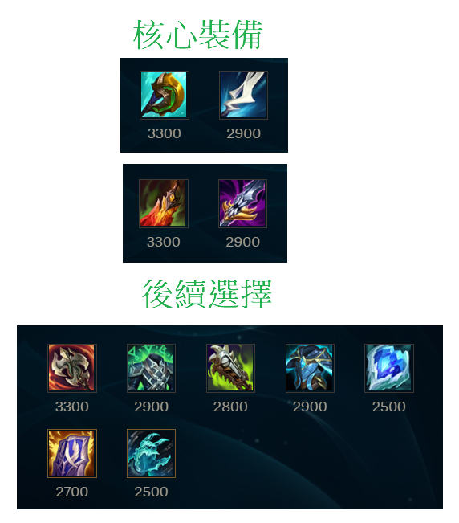
  + ### NOTE
        主Q副E

        攻擊手段主要是靠被動的破綻，但不要為了打而打，要看破綻位置
        可以用Q去戳破綻，只要跟破綻一直線Q就能戳到
        例如:破綻在敵人12點鐘方向，你從6點鐘方向Q過去就會剛好打到破綻

        W也可以打破綻，但要正前方，就不能像Q一樣了，因為Q是帶有位移的

        連招
        R-W-A-Q-A
        起手R+W就可以瞬間破一個破綻，然後用走位A與Q能破剩下的

        注意進場時機，不要被集火，拉扯就對惹

+ ## 波比
  + ### 天賦
    
  + ### 召喚師技能
    
  + ### 出門裝
    
  + ### 出裝
    
  + ### NOTE
        主Q副E

        利用W加速將敵方E牆，也可用閃+E

        E人鼠標要在敵方身上按E，最好是自己、敵方、牆是一直線的情況下E
        R如果只按一下會直接把敵人敲起來，可用來搭配連招，如果R是長按就會增長可把敵人敲飛

        連招
        E-A-Q-A-R-A

+ ## 維克特
  + ### 天賦
    
  + ### 召喚師技能
    
  + ### 出門裝
    
  + ### 出裝
    
  + ### NOTE
        主E副Q
        E改手動施法

        按E會有圈圈可看施放位置
        poke時，放E盡量放在圈圈外面，腳色會走過去放，若途中有危險可即時取消

        W是留人、切割戰場技能，不要隨便放

        R二次施放可以自行移動圈圈位置
        R可配合W留人來施放

        Q-A消耗

+ ## 希維爾(輪子媽)
  + ### 天賦
    
  + ### 召喚師技能
    
  + ### 出門裝
    
  + ### 出裝
    
  + ### NOTE
        主W副E

        現在的E阻擋成功會回血

+ ## 勒布朗(妖姬)
  + ### 天賦
    
  + ### 召喚師技能
    
  + ### 出門裝
    
  + ### 出裝
    
  + ### NOTE
        主Q副W

        妖姬的被動是血量低於40會創造分身，可按alt來操控分身
        分身也可以幫擋女警R

        R是複製前一次用的小招

        由於Q這個印記是要由另一個小招打中敵人才會比較強
        因此，會有QR、QW、QE...等

        最簡單的清兵就是WR雙踏清兵

        連招很多
        W-Q-E-W(回去原位置)
        W-R-Q-E-W(回去原位置)

+ ## 提摩(必須死)
  + ### 天賦
    
  + ### 召喚師技能
    
  + ### 出門裝
    
  + ### 出裝
    
  + ### NOTE
        主Q副E

        地雷戰
        R不到3級前，蘑菇炸兵線就可以惹
        蘑菇要點距離，因為不會疊加
        如果可以，請隊友幫忙清砲車

        R達到3級以後，兵線上與兵線附近種蘑菇

        麻雀戰
        Q-A偷脆皮，打完基本就要閃惹

+ ## 汎(薇恩)
  + ### 天賦
    
  + ### 召喚師技能
    
  + ### 出門裝
    
  + ### 出裝
    
  + ### NOTE
        主W副Q

        E可以把敵方釘在牆上

+ ## 法洛士(韦鲁斯)
  + ### 天賦
    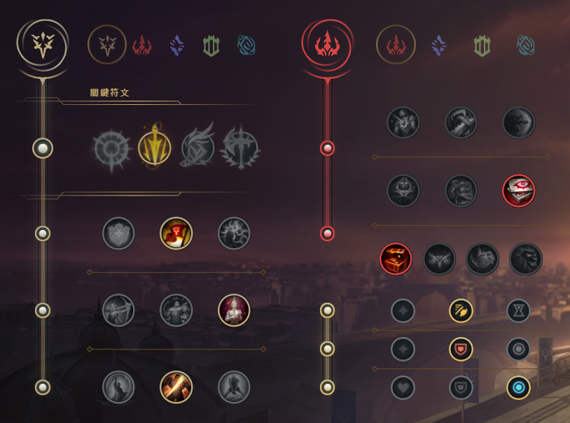
  + ### 召喚師技能
    
  + ### 出門裝
    
  + ### 出裝
    
  + ### NOTE
        主Q副E

        Q、R改手動施法

+ ## 菲艾(蔚)
  + ### 天賦
    
  + ### 召喚師技能
    
  + ### 出門裝
    
  + ### 出裝
    
  + ### NOTE
        主Q
        對面肉多副W
        對面脆皮多副E

        最好搭配多個進場英雄，配合Q接控制

        Q按住後會有要衝刺的線
        可以用Q閃
        Q能打到的範圍比實際上的箭頭遠一點

        基本上連招只是把全部的招式按一輪中間穿插A而已
        Q-A-E-A-R-A

+ ## 卡力斯(螳螂, 小寒冰)
  + ### 天賦
    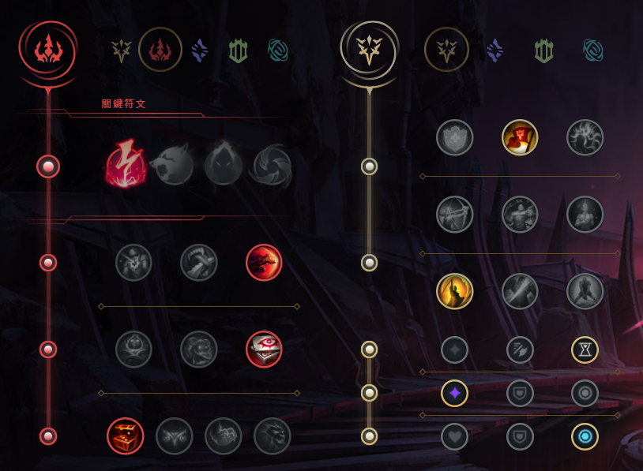
  + ### 召喚師技能
    
  + ### 出門裝
    
  + ### 出裝
    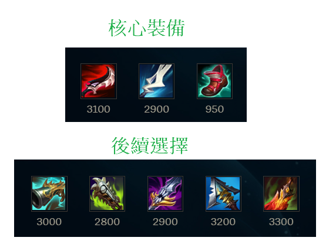
  + ### NOTE
        主W副Q

        R主要的功能是隱身，進場刺殺後排，然後跳回來
        R在時間內可用兩次
        R可以升級Q、W、E技能
        R升級小招的順序W-E-Q/R

        螳螂是孤立腳色，一旦消失在敵方視野會獲得一次被動
        所以要多進草刷被動
        R可以直接搞隱身+被動

        找機會E/雪球進場，不要正面硬剛

        基本連招
        A-Q

+ ## 赫克林(人馬)
  + ### 天賦
    
  + ### 召喚師技能
    
  + ### 出門裝
    
  + ### 出裝
    
  + ### NOTE
        主Q副E

        進場踢人前，要先把Q的兩層疊好
        可以Q小兵疊層

        E撞到小兵是有用的，所以如果要撞人要注意小兵

        連招
        E-R開團-2層Q

+ ## 柔依(佐伊)
  + ### 天賦
    
  + ### 召喚師技能
    
  + ### 出門裝
    
  + ### 出裝
    
  + ### NOTE
        主Q副E

        Q的飛行距離越遠，攻擊力越高
        Q有兩段，可以直接用Q打人，但那樣傷害最低
        Q用兩段打人會導致飛行距離變長而傷害變高
        第一段Q通常會Q向反方向，在倒數結束前按二段Q，Q人
        要注意Q的飛行距離不能有小兵，要不然會被擋住

        有人要近身，就用E丟他

        基本連招
        Q-Q-R
        利用R的位移增加二段Q飛行的距離
        簡單來說就是先啟動二段Q讓Q飛行，快速按R，讓Q帶到敵人身上
        R做位移後可以順便丟E

        ARAM專屬連招
        雪球-Q-Q-R-雪球
        利用雪球擊中敵人後的二段雪球會飛去敵人邊的效果，搭配R技能會返回原位置的效果打出連招
        注意，雪球只有3秒，所以連招動作要快

+ ## 瑟菈紛(歌姬)
  + ### 天賦
    
  + ### 召喚師技能
    
  + ### 出門裝
    
  + ### 出裝
    
  + ### NOTE
        主Q副W

        被動是第3次的技能就是加強版
        基本上加強版就是給W，W建議只放加強版的
        判斷加強版看小招背景顏色是黃色即可

        E是控制技能，在出冰仗以前可以配合隊友的緩速技能做施放

+ ## 吶兒(小薇恩)
  + ### 天賦
    
  + ### 召喚師技能
    
  + ### 出門裝
    
  + ### 出裝
    
  + ### NOTE
        主Q副W

        R的方向是吶兒與鼠標的位置，鼠標在哪就推哪

+ ## 賽恩
  + ### 天賦
    
  + ### 召喚師技能
    
  + ### 出門裝
    
  + ### 出裝
    
  + ### NOTE
        主W副Q

        可用草叢Q，也可雪球進場Q

        連招
        雪球-E-雪球 開團
        雪球-E-雪球-W-Q-R
        E是把東西向前丟，此開團方式是先向小兵丟雪球，把用E把雪球擊中的小兵丟出去
        最後雪球回去丟出去的小兵，完成長距離的位移

        R最好直接撞正前方的人，不要遠遠開大來撞，容易撞不到

+ ## 龍獸(龍王)
  + ### 天賦
    
  + ### 召喚師技能
    
  + ### 出門裝
    
  + ### 出裝
    
  + ### NOTE
        主Q副W

        R改手動施法

        Q能跟E一起飛，也就是先Q後，馬上按E用自身飛行帶著Q飛
        二段Q可以讓Q停下來，擊中敵人造成暈眩
        二段E也是可以讓自身停下來
        所以，常見就是Q-E一起飛(也可一起按)，然後碰到敵人一起按Q-E停下，再補下A觸發電刑
        最好先看一下E的最大飛行範圍

+ ## 弗力貝爾(狗熊)
  + ### 天賦
    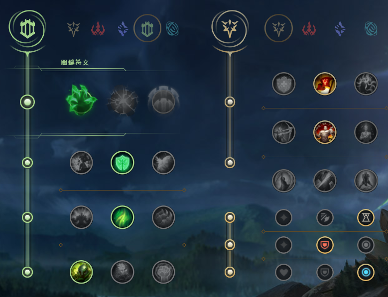
  + ### 召喚師技能
    
  + ### 出門裝
    
  + ### 出裝
    
  + ### NOTE
        主W副Q

        R改手動施法

        R只有小圈內才會對敵方造成傷害，大圈只是用來屏蔽防禦塔

        Q、W都能重置普攻

        連招
        E-Q-A-W-A 

+ ## 加里歐(加里奥)
  + ### 天賦
    
  + ### 召喚師技能
    
  + ### 出門裝
    
  + ### 出裝
    
  + ### NOTE
        主W副Q

        W改手動施法

        在草裡E出去撞人，開嘲諷(W)

        連招
        E-W
        雪球-W

+ ## 艾妮維亞(冰鳥、鳳凰)
  + ### 天賦
    
  + ### 召喚師技能
    
  + ### 出門裝
    
  + ### 出裝
    
  + ### NOTE
        輔助
        主Q副E

        傷害
        主E副Q

        冰鳥的一級W就可以把塔旁邊的縫隙填滿了
        冰鳥的W方向是相對於冰鳥的
        如果鼠標點W的位置是冰鳥的正東南西北方，那你就會看到牆是平的
        如果鼠標點W的位置是冰鳥的東北/東南方..之類的，那你就會看到牆是斜的

        連招
        Q-W-Q-E
        先放Q讓其飛行，W馬上擋人去路，再二段Q定人

        R-Q-W-Q-E
        一樣有Q-W二連，主要是先用R來緩慢走位，當然也可以先用Q-W再用R

+ ## 葵恩
  + ### 天賦
    
  + ### 召喚師技能
    
  + ### 出門裝
    
  + ### 出裝
    
  + ### NOTE
        主Q副E

+ ## 姍娜
  + ### 天賦
    
  + ### 召喚師技能
    
  + ### 出門裝
    
  + ### 出裝
    
  + ### NOTE
        主Q副W

+ ## 珍娜(風女)
  + ### 天賦
    
  + ### 召喚師技能
    
  + ### 出門裝
    
  + ### 出裝
    
  + ### NOTE
        主E副Q

        主要是靠E給隊友增加物攻與盾

        Q有兩段，第一段放風，第二段把風吹向當初的鼠標方向
        第二段Q沒按，3秒後也會自動施放

        R除了治療隊友以外還可以擊退敵人

+ ## 凱特琳(女警)
  + ### 天賦
    
  + ### 召喚師技能
    
  + ### 出門裝
    
  + ### 出裝
    
  + ### NOTE
        主Q副W

        連招
        E-Q
        指著敵人E，再按Q

        E-WW-A-Q-A
        往後E的同時，在敵方腳下按WW(要按兩下)，接著A，如果可以再多Q-A

+ ## 威寇茲(大眼)
  + ### 天賦
    
  + ### 召喚師技能
    
  + ### 出門裝
    
  + ### 出裝
    
  + ### NOTE
        主Q副W

        主要是打出被動的傷害

        Q打中敵方能造成緩速

        連招
        W-E
        也可以一起按，基本上只要兩招有中對面，被動就會出來

        W-E-Q-R-W

        注意:R一定要最後按，因為R的期間不能按小招，所以一定要把小招全部按完再按R
        基本上R之前最好至少要打小招到對方身上

