# 這是LOL中ARAM場的筆記

+ ## 一些建議
  + ### 法師是否出門裝出法球
        主要是看是否需要吃傷害，像烏鴉、血鬼這種就買，若是長手丟丟怪就不需要
  + ### 召喚師技能選擇
    
  + ### 團員構成
        傷害均衡(2AD或3AD)，資源分配合理(發育的英雄不要太多)
        6級前掛機英雄最多2個
        硬控不能太少
        要選戰士的話，最好隊伍要有其它的戰士/坦克，盡量不要單選戰士(劍聖除外)
  + ### 血包
        血包是回復比例的血值，血會少的當然回血越多，血包跟光圈有差異
        假設滿血為100%，當前生命為x%(0< x < 100)
        光圈回血量為(100 - x) * 16%
        血包+光圈回血量為(100 - x) * 8% + [ 100 - (100 - x) * 8% - x] * 16%
        兩者差距為6.72% * (1 - x%)的最大生命值
  + ### 站位
    **若隊友沒有一開始就出來，就站在一血包的前面一點點就好，如下圖**
    
    + #### 分散(適用於對方有團控的陣容)
          不要和你的主C站在一起，易買一送一
          殘局若一定會死的情況下選擇反跑，避免被敵方利用做進場的跳板
    + #### 抱團(適用於對面針對單體的陣容)          
          靠近你的主C，第一時間準備好控制、虛弱、點燃
          保護主C或幫擋技能 
  + ### 雪球
          有兩段機制
          第一段打中目標才會有第二段
          第二段為位移至命中目標身邊
          傷害為15-100(隨等級提升)的真實傷害
  + ### 英雄選擇
    + #### T0 好玩必選
      |英雄|綽號|
      |:-|:-|
      |好運姐|女槍|
      |卡爾瑟斯|死哥|
      |茂凱|大樹|
      |剛普朗克|船長|
      |凱莎||
      |易大師|劍聖|
      |伊澤瑞爾|EZ|
      |婕莉|澤麗|
    + #### T1 優質選
      |英雄|綽號|
      |:-|:-|
      |布蘭德|火男|
      |艾希|寒冰、IC|
      |阿璃|狐狸|
      |藍寶||
      |魔甘娜||    
      |泰達米爾|蠻王|
      |斯溫|烏鴉|
      |索拉卡|奶媽|
      |維迦|小法|
      |趙信||  
      |圖奇|老鼠|
      |睿娜妲||
      |塔隆|男刀|
      |悟空|猴子|
      |菲歐拉|劍姬|
      |希維爾|輪子媽|
      |提摩|必須死|
      |汎|薇恩|
      |法洛士|韦鲁斯|
      |加里歐|加里奥|
      |葵恩||
      |姍娜||
      |凱特琳|女警|
      |雷歐娜|女坦、日女|   
      |妮可||  
      |鏡爪|千珏| 
      |路西恩|卢锡安|
      |潘森||
      |卡蜜兒|青钢影|
      |阿姆姆|哭啊、木乃伊|
      |亞歷斯塔|牛牛、牛頭|
      |煞密拉|沙漠玫瑰|
      |拉克絲|拉個屎|
      |杰西|JC|
      |馬爾札哈||
    + #### T2 可選
      |英雄|綽號|
      |:-|:-|
      |卡特蓮娜||
      |希格斯|炸彈人|
      |葛雷夫|男槍|
      |科加斯|大蟲子| 
      |蓋倫||
      |希瓦娜|龍女|
      |燼||
      |魔鬥凱薩|鐵男|  
      |達瑞斯|諾手| 
      |納瑟斯|狗頭|
      |費德提克|稻草人|
      |犽凝|永恩|
      |墨菲特|石頭人|
      |蒙多醫生||
      |薩科|小丑|
      |凱爾|天使|
      |布里茨|機器人|
      |派克||
      |厄薩斯|劍魔、234|
      |鄂爾|山羊|
      |波比||
      |卡力斯|螳螂、小寒冰|
      |赫克林|人馬|
      |柔依|佐伊|
      |瑟菈紛|歌姬|
      |吶兒|小薇恩|
      |賽恩||
      |艾妮維亞|冰鳥、鳳凰|
      |威寇茲|大眼|
      |齊勒斯|泽拉斯| 
      |剎雅|霞|  
      |史瓦妮|豬女| 
      |沃維克|狼人|
      |貪啃奇|塔姆|
      |賽特|拳皇、腕豪、瑟提|
      |拉姆斯|龍龜|
      |關|格溫、靈羅娃娃|
      |逆命|卡牌|
      |漢默丁格|泡麵頭、大頭|
      |維克特||
      |寇格魔|大嘴|
      |辛吉德|跑跑人、煉金|
      |阿祈爾|R72、沙皇|
      |莉莉亞|小鹿|
      |卡瑪|扇子媽|
      |吉茵珂絲|金克絲、暴走蘿莉|
      |凱能|凱南|
    + #### T3 勉強選
      |英雄|綽號|
      |:-|:-|    
      |弗拉迪米爾|吸血鬼|
      |塔莉雅|岩雀|
      |黛安娜|皎月|
      |貝爾薇斯|虛空女皇|
      |巴德||           
      |勒布朗|妖姬|
      |菲艾|蔚|
      |龍獸|龍王|
      |弗力貝爾|狗熊|
      |珍娜|風女|
      |嘉文四世|皇子|
      |安妮||
      |伊羅旖|俄洛伊| 
      |烏爾加特|戰車|
      |極靈|時光|
      |夜曲|夢靨|
      |伊瑞莉雅|刀妹|
    + #### T4 盡量不要選          
      |英雄|綽號|
      |:-|:-|
      |埃爾文|翠神、艾翁|
      |索娜|琴女|

+ ## 漢默丁格(泡麵頭、大頭)
  + ### 天賦
    
  + ### 召喚師技能
    
  + ### 出門裝
        
  + ### 出裝
    
   + ### NOTE
          主Q副W

          連招
          E(到人)-Q-W
          E-A-W
          E-A-R-W
          R-Q-E-W

+ ## 布蘭德(火男)
  + ### 天賦
    
  + ### 召喚師技能
    
  + ### 出門裝
    
  + ### 出裝
    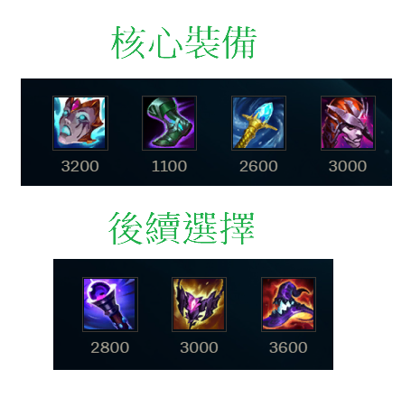
  + ### NOTE
        主W副Q

        E是會擴散的，正確用法是向兵線丟W，再對W到的小兵丟E形成擴散
        要注意E跟R只會擴散鄰近一個的敵人，所以一直線的敵人中丟中間的那位E會比較划算

        連招
        W-E-R

+ ## 卡特蓮娜
  + ### 天賦
    
  + ### 召喚師技能
    
  + ### 出門裝
        
  + ### 出裝
    
  + ### NOTE
        可AD可AP，AD容錯較高，若本團沒AP在出AP

        被動是3秒內殺死敵方英雄可以-15秒CD

        Q、E都要點在敵方身上

        AP卡特
        主Q副E

        AD卡特
        主E副Q

        連招
        Q-E-A，Q丟出刀後，滑鼠指向刀落地點按E，卡特即會飛過去刀的落地點並砍

        Q-E-W

        Q-E-W-R(好用)
        不用管E有沒有撿到Q的刀，反正R結束後還可以再撿

        基本上大絕要配合Q-E進場或者其他方式進場到中央
        R前一定要放W，會比較順

+ ## 好運姐(女槍)
  + ### 天賦
    
  + ### 召喚師技能
        
  + ### 出門裝
    
  + ### 出裝
    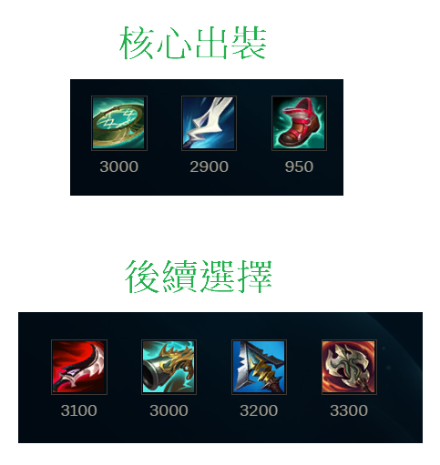
  + ### NOTE
        主E副Q
        如果敵方英雄站小兵後面，Q小兵

        E-R連招

+ ## 卡爾瑟斯(死哥)
  + ### 天賦
    
  + ### 召喚師技能
    
  + ### 出門裝
            
  + ### 出裝
    
  + ### NOTE
        主E副Q

        先攻死哥
        一定要讓大招觸發先攻(要注意對方是否人都活著)
        開團，雪球打到小兵或人後，開E飛過去觸發先攻

+ ## 艾希(寒冰、IC)
  + ### 天賦
    
  + ### 召喚師技能
    
  + ### 出門裝
        
  + ### 出裝
    
  + ### NOTE
        主W副E

        R飛到對方泉水的時間
        己方泉水 8秒
        己人第一血包處 5秒
        敵人第一血包處 4秒
        敵人第二血包處 3秒

+ ## 弗拉迪米爾(吸血鬼)
  + ### 天賦
    
  + ### 召喚師技能
    
  + ### 出門裝
    
  + ### 出裝
    
  + ### NOTE        
        主Q副E

        E技能改手動施法

        Q兵吸血，補兵，Q兩次以後，會自動在2秒後強化Q，底下也會是紅條
        可以利用觸發相位猛衝讓敵方吃紅Q
        W撞到敵人可緩速敵人
        E會耗血的攻擊，所以千萬別用E吃兵

        連招

        雪球-E-W(要常用，但要在有相位的時候用)
        雪球過去，EW一套打完就回來

        E-R-Q-W
        先開E續力，雪球或閃現過去敵方，讓敵方吃二段E的傷害，迅速開R後Q，W離開戰場

        E-Q
        先開E續力，調整E的範圍，然後再E自動爆開以前對敵方按Q，Q是能提前讓E自動爆開的

+ ## 希格斯(炸彈人)
  + ### 天賦
    
  + ### 召喚師技能
    
  + ### 出門裝
        
  + ### 出裝
    
  + ### NOTE        
        主Q副E

+ ## 葛雷夫(男槍)
  + ### 天賦
    
  + ### 召喚師技能
    
  + ### 出門裝
    
  + ### 出裝
    
  + ### NOTE
        主Q副E

        換彈的期間E-Q
        Q可以打牆，彈道牆附近敵人造成傷害

        沒牆就用煙霧彈輔助Q的命中

        這隻腳色就是要不斷的走位、走位再走位
        因為主要輸出還是要靠平A

+ ## 阿璃(狐狸)
  + ### 天賦
    
  + ### 召喚師技能
    
  + ### 出門裝
        
  + ### 出裝
    
  + ### NOTE
        主Q副W

        連招
        E-Q-W

        準頭不夠就出永霜
        出招順序
        永霜 -> E

+ ## 科加斯(大蟲子)
  + ### 天賦
    
  + ### 召喚師技能
        
  + ### 出門裝
    
  + ### 出裝
    
  + ### NOTE
        主Q副W

        大招可以先吃兵就吃兵疊層數，不一定要等到吃英雄

+ ## 茂凱(大樹)
  + ### 天賦
    
  + ### 召喚師技能
        
  + ### 出門裝
        
  + ### 出裝
    
  + ### NOTE
        主E副Q

        Q: 會擊退敵方
        W: 帶有位移，衝向敵方，定身敵方
        E: 樹兒子，主要輸出手段，只要注意兵線，盡量不要被小兵吃到就好
        盡量往草叢邊緣丟E，不然容易被小兵碰到
        R: 範圍藤蔓定身敵方，也可以繞到敵方身後丟R，限制敵方撤退路線

        不要當坦

        連招
        W-A-Q
        W到敵方身邊，A一下，走到敵方身後，把敵方Q回來

        W-E-Q(敵方在草叢邊)
        W到敵方身邊，E往草里丟，Q把敵方推向草
        也可先手E丟草裡，再W-Q把敵方推向草

        W-A-R-A-Q-E

+ ## 剛普朗克(船長)
  + ### 天賦
    
  + ### 召喚師技能
        
  + ### 出門裝
    
  + ### 出裝
    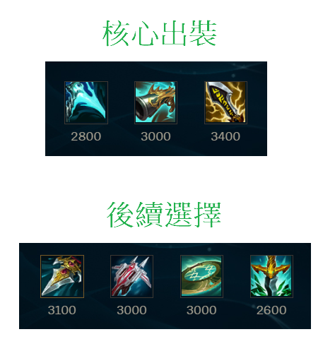
  + ### NOTE
        6級前主Q
        6級後主E
        用Q搶頭搶砲車
        R改手動施法

        小招升級由左到右即可

        盡量先買2~3個爆擊斗篷

        連桶重點不是要刻意去量桶子，而是你跟敵人間的距離
        平A二連桶基本上就是第一個桶子會在自己的腳下，第二個桶子會在敵人的腳下
        所以是要看你跟敵方的距離，你覺得二連桶能不能炸到為主
        然後第二個桶子可以放在第一個桶子的範圍與敵人間的中間點

        在ARAM的場地裡面，場地的寬剛好可以連成三個桶，也就是依照中線為主，大概觀測一下角度偏移量
        場地橫斜向三連桶好用
        草叢放第一桶等變一格，中線放第二個桶子後，Q草叢桶子，立馬在右線放第三個桶子，完成三連桶
        因為，場地寬就是可以三連桶成立，所以先在草叢藏桶，放第二桶子後立即Q第一桶子再放第三桶子

        二連桶
        13級前 E-A-E-Q
        要先A桶子一下
        然後盡量第一個桶子放自己身邊

        13級後可以EEQ

        3連桶以上是可以在Q桶之後瞬間擺新桶一起爆炸的(連桶爆炸有時間差)，但是要注意桶子的庫存還有手速要快
        2連桶建議確定擺上新桶後瞬間點第一個桶引爆
        2連桶也是可以打第一個桶子再放第二個桶引爆，但手速跟位置要快，不然很容易沒引爆到
        建議還是平A 2連桶
        炸桶子會刷新被動火刀的CD

        連招
        先用火刀A人，炸桶子，再A人跟Q

        Q二連桶(最好在13級後再用)
        第一個桶子要遠離自己，迫使一定要走過去Q，接著等抬手的瞬間在新的位置放桶

        感覺ARAM裡面橫的連桶，或斜的連桶比較好炸到人       

+ ## 凱莎
  + ### 天賦
    
  + ### 召喚師技能
        
  + ### 出門裝
    
  + ### 出裝
    
  + ### NOTE
        主Q副W

        先合成魔宗進化Q    

+ ## 蓋倫
  + ### 天賦
    
  + ### 召喚師技能
    
  + ### 出門裝
            
  + ### 出裝
    
  + ### NOTE
    主Q副E

+ ## 易大師(劍聖)
  + ### 天賦
    
  + ### 召喚師技能
    
  + ### 出門裝
        
  + ### 出裝
    
  + ### NOTE
        主Q副E

        前期弱，不要腦衝，兩件套以前盡量不要太衝

        最後一定是這6件裝，只是順序可變
        第一件一定出破敗
        第二件出日炎
        第三件出智慧末刃或死舞，看對面陣容

        Q: 是打指定的目標及其附近的敵人，最後落點會是指定目標的附近
        也就是可以Q小兵，然後小兵附近的敵人也會被傷害到，但最後落點會是小兵的附近
        Q盡量用來收尾，一開始可以拿來當poke用

        W: 治療，可重置普攻

        不要Q起手，要打團盡量E+平A起手
        打半條血以上的敵人，開大過去平A起手，到斬殺線再Q       

+ ## 希瓦娜(龍女)
  + ### 天賦
    
  + ### 召喚師技能
    
  + ### 出門裝
    
  + ### 出裝
    
  + ### NOTE
        AP龍女
        主E副W

        AD龍女
        主E副Q

        不管是哪個龍女，基本上都還是靠大招後才行

        ARAM中龍女有多一個被動
        敵方砲車死亡自動加層數
        血包要吃敵方的才會加層數

        AD龍女
        先E中敵人在Q

+ ## 燼
  + ### 天賦
    
  + ### 召喚師技能
        
  + ### 出門裝
    
  + ### 出裝
    
  + ### NOTE
        主Q副W

+ ## 藍寶
  + ### 天賦
    
  + ### 召喚師技能
    
  + ### 出門裝
    
  + ### 出裝
    
  + ### NOTE  
        主Q 副E
        R改手動施法

        燒到一半按金人還是會繼續燒
        Q在燒人的時候放E不會中斷燒人

        連招
        50度左右WQE，追擊紅溫平A+E

+ ## 魔甘娜
  + ### 天賦
    
  + ### 召喚師技能
    
  + ### 出門裝
        
  + ### 出裝
    
  + ### NOTE
        主W副Q

+ ## 魔鬥凱薩(鐵男)
  + ### 天賦
    
  + ### 召喚師技能
    
  + ### 出門裝
           
  + ### 出裝
    
  + ### NOTE
        主Q副E

        抗性裝備也可以考慮出深淵面具
        先E再R鎖地形

+ ## 泰達米爾(蠻王)
  + ### 天賦
    
  + ### 召喚師技能
    
  + ### 出門裝
          
  + ### 出裝
    
  + ### NOTE
        主Q副E

        Q主要是被動有加攻擊力，團戰盡量不要拿Q去補血，因為怒氣能增加暴擊率

        W等敵方背對你時再用能緩速他

        要注意敵方若有蒐集者的話，血量要多留點開大    

+ ## 伊澤瑞爾(EZ)
  + ### 天賦
    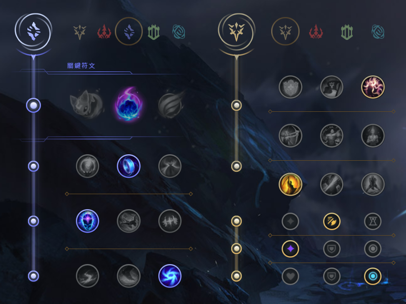
  + ### 召喚師技能
    
  + ### 出門裝
            
  + ### 出裝
    
  + ### NOTE    
        主Q副E

        W佛系攻擊，沒中沒差

        連招
        E-Q-A
        E-W-Q-A
        E人臉Q中，走回來，但要先注意敵方位置

        R飛到對方泉水的時間
        己方泉水 14秒
        己人第一血包處 6秒
        敵人第一血包處 5秒
        敵人第二血包處 4秒

+ ## 斯溫(烏鴉)
  + ### 天賦
    
  + ### 召喚師技能
        
  + ### 出門裝
    
  + ### 出裝
    
  + ### NOTE
        主Q副W

        主要是多多累積被動
        W、E每弄到一名敵方英雄會提供1層
        每一名敵方英雄陣亡會提供1層

        E-W連招(注意: W有2.5秒才會爆掉，所以二段E不能太急著按)
        先用第一段的E -> 如果有抓住敵人，再敵人離你的路徑中放W(也可放在敵人腳下)，接著再二次E抓回來讓敵人吃W
        E是彈出去抓，還會彈回來，來回彈到敵人才能將敵人抓回來
        個人覺得等W的眼睛出現再按二段E就好

        回血
        疾跑 + E
        腳下W + 金人

+ ## 達瑞斯(諾手)
  + ### 天賦
    
  + ### 召喚師技能
    
  + ### 出門裝
    
  + ### 出裝
    
  + ### NOTE
        主Q副E

        需要不斷拉扯，盡量疊好血怒或殘局再出去
        移速、韌性、坦度是達瑞斯在ARAM中最重要的幾個屬性
        Q跟A擊中敵人會疊被動

        注意: Q敵人一定要是外圈，不然不能疊被動，最內圈不能疊
        被動5層滿

+ ## 索拉卡(奶媽)
  + ### 天賦
    
  + ### 召喚師技能
        
  + ### 出門裝
    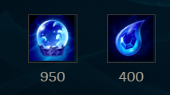
  + ### 出裝
    
  + ### NOTE
        主W副E
        還沒出好戰者之前，不要奶的太激進，盡量賺錢
        E技能主要是防守、封走位、限制突進
        E蠻適合對方刺客雪球到自家C位時，腳下放E

+ ## 維迦(小法)
  + ### 天賦
    
  + ### 召喚師技能
    
  + ### 出門裝
    
  + ### 出裝
    
  + ### NOTE
        主Q副E

+ ## 塔莉雅(岩雀)
  + ### 天賦
    
  + ### 召喚師技能
        
  + ### 出門裝
    
  + ### 出裝
    
  + ### NOTE
        主Q副E
        Q、W取消自動施法
        W選擇敵方腳下，按住滑鼠左鍵選擇方向放開
        連招
        W-E-Q(一定要等W開始動作在接EQ)

        受傷時不能放R

+ ## 趙信
  + ### 天賦
    
  + ### 召喚師技能
    
  + ### 出門裝
    
  + ### 出裝
    
  + ### NOTE
        主W副Q

        積極A兵回血
        沒有大招只能後上，有大招才有先進場能力
        E-R開團

+ ## 納瑟斯(狗頭)
  + ### 天賦
    
  + ### 召喚師技能
    
  + ### 出門裝
    
  + ### 出裝
    
  + ### NOTE
        主Q副W

        Q兵，Q兵，Q兵
        尤其是砲車
        用雪球丟炮車，搶砲車，搶砲車，搶砲車
        隊友打團，放個E意思意思一下，專心Q兵
        盡量心無雜念專心Q兵疊到200層以後再打人

+ ## 圖奇(老鼠)
  + ### 天賦
    
  + ### 召喚師技能
    
  + ### 出門裝
    
  + ### 出裝
    
  + ### NOTE
        主E副Q
        Q主要是跑去後面偷後排
        潛行者之爪主要是拿來做位移調整位置的

+ ## 費德提克(稻草人)
  + ### 天賦
    
  + ### 召喚師技能
    
  + ### 出門裝
    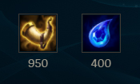
  + ### 出裝
    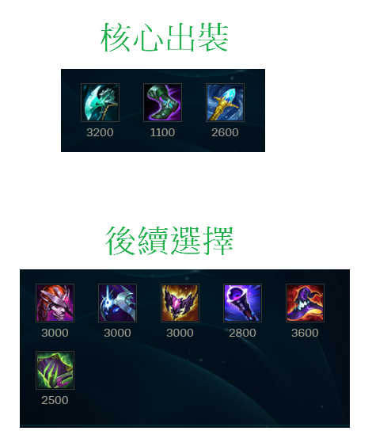
  + ### NOTE
        主Q副E

        不要頂著對面的輸出去吸血
        目前吸血效果被削弱，不要指望

        注意:只有Q技能可以觸發冰川增幅，其餘的都不能

        草人的插眼是四號格，所以要趕快把普羅的飼料用掉

+ ## 犽凝(永恩)
  + ### 天賦
    
  + ### 召喚師技能
    
  + ### 出門裝
    
  + ### 出裝
    
  + ### NOTE
        主Q副E
        非常依賴閃現的英雄
        連招
        EQ閃接R 開團切入
        W閃Q 收拾殘局進行收割
        殘局盡量不要用閃現逃跑
        常見打法
        用Q疊風(Q中敵人兩次後，Q會變成風型態)
        Q打小兵也可以疊
        再打EQ或EQ閃接R

+ ## 黛安娜(皎月)
  + ### 天賦
    
  + ### 召喚師技能
    
  + ### 出門裝
    
  + ### 出裝
    
  + ### NOTE
        主Q副W

        P: 每第三次攻擊會造成額外傷害跟加攻速
        所以，盡量在連招前打小兵疊兩層被動，再QE連招上去

        連招
        Q-E會刷新E，QE可以同時按，滑鼠指向敵方同時按QE
        Q-E後穿插A來觸發被動
        可R閃

        Q-E-W-E

+ ## 睿娜妲
  + ### 天賦
    
  + ### 召喚師技能
    
  + ### 出門裝
    
  + ### 出裝
    
  + ### NOTE
        主E副W

        給隊友加頓的大號風女、大號露露
        陣容有ADC才適合睿娜妲出場，專養ADC的

        W主要用途是給隊友加攻速跟移速，所以隊友要輸出時就給
        盡量不要只把W當救命技能
        Q在把敵人拉回來的途中如果有撞到其他敵人則會暈眩
        R也可以在ADC輸出時放ADC前面保障ADC的安全

+ ## 貝爾薇斯(虛空女皇)
  + ### 天賦
    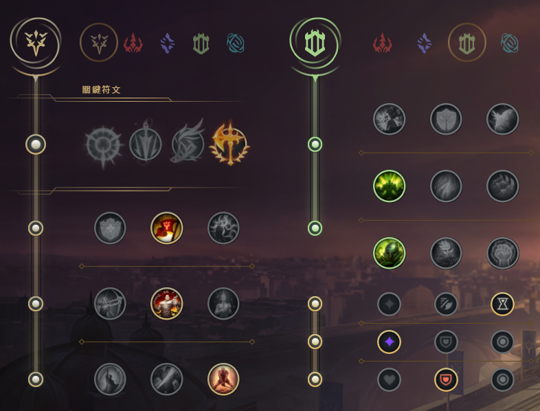
  + ### 召喚師技能
    
  + ### 出門裝
    
  + ### 出裝
    
  + ### NOTE
        主E副Q
        目前還是當坦克玩，沒啥輸出

+ ## 婕莉(澤麗)
  + ### 天賦
    
  + ### 召喚師技能
    
  + ### 出門裝
        
  + ### 出裝
    
  + ### NOTE
        主W副Q
        E改成手動施法
        W在如果貼著障礙物可穿牆並變大範圍
        ARAM中W是蠻好用的一個招式
        W射障礙物途中不能有敵方小兵或敵人，不然會被阻擋

        中間一草的牆壁可以直接W到二草
        中間的牆壁缺口也可以用
        如果要從草叢打向血包處要用特殊技巧
        往後靠牆E，然後鼠標指向血包按W，一定要長得E
        基本上就是長距離的移動靠牆可以用W強化

+ ## 塔隆(男刀)
  + ### 天賦
    
  + ### 召喚師技能
    
  + ### 出門裝
    
  + ### 出裝
    
  + ### NOTE
        主W副Q

        P: 攻擊會疊層，疊滿3層有額外傷害
        Q: 位移，戳向敵人造成傷害
        W: 迴力匕首，來回都刮到會是兩層被動，返回的匕首可造成敵人減速
        E: 翻牆
        R: 釋放多個匕首，並隱身最多2.5秒，隱身結束所有匕首會回到手上

        一般都是用W蹭傷害，如果太遠可以Q小兵位移再用W蹭傷害

        連招
        W-Q-A
        常用小連招，先丟第一段W，中後Q上去，A到被動觸發就走
        W刮到後，最好是等要飛回來的時候Q上去，不要一放W就Q上去

        W-R-Q-A
        要注意連招的R一定要刮到，這樣才可以到三層被動

        雪球-R-Q-W
        利用雪球進場，開大隱身，往前Q目標，再加W

+ ## 墨菲特(石頭人)
  + ### 天賦
    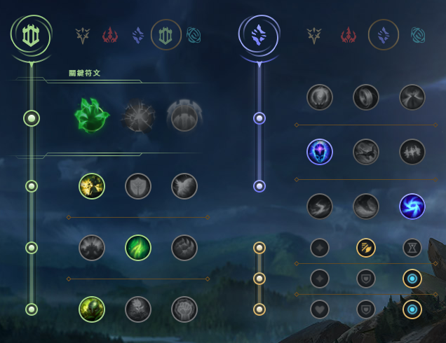
  + ### 召喚師技能
        
  + ### 出門裝
    
  + ### 出裝
    
  + ### NOTE
        主Q副E

        R改手動施法

+ ## 悟空(猴子)
  + ### 天賦
    
  + ### 召喚師技能
    
  + ### 出門裝
    
  + ### 出裝
    
  + ### NOTE
        主Q副E

        玩猴子一定要普攻AAAAA

        連招
        E-Q-R-W-Q-二段R
        雪球-Q-R-W-Q-二段R

+ ## 蒙多醫生
  + ### 天賦
    
  + ### 召喚師技能
    
  + ### 出門裝
    
  + ### 出裝
    
  + ### NOTE
        主Q副E
        蒙多醫生是左手丟斧頭，角度要喬一下
        丟斧頭可以只點自己與目標之間的路徑即可
        被動可以抵擋一次控制技能，被動觸發會掉藥劑，記得撿起來
        注意:敵方也可以撿藥劑
        W為爆發傷害，W開啟W關閉，最多4秒，CD長，耗損自身5%生命值
        W要貼敵方臉的時候再用
        E使用時會增加50的攻擊距離

+ ## 薩科(小丑)
  + ### 天賦
    
  + ### 召喚師技能
    
  + ### 出門裝
        
  + ### 出裝
    
  + ### NOTE
        主E副W

        收割英雄
        很吃裝備，盡量搶人頭

        不太需要閃現，有問題Q走就好

        P: 被刺傷害更高，在背面跟斜側面都能觸發
        Q: 小段位移+隱形2.5秒，隱形期間攻擊敵方傷害會比較高
        W: 製造一個盒子，盒子能擋技能，2秒後會變成40秒的陷阱
        E: 中距離的丟丟攻擊，被刺一樣會比較痛
        R: 創造一個18秒的分身，可用Alt來操作分身，分身死後會變成三個盒盒
        產生分身的一段時間是無敵的，可躲死哥大

        基本玩法
        Q隱形到敵方身後放W，然後一直追著敵方平A到殘血，用E收割

+ ## 巴德
  + ### 天賦
    
  + ### 召喚師技能
    
  + ### 出門裝
    
  + ### 出裝
    
  + ### NOTE
        主Q副W
        E、R改手動施法

        Q的如果命中到兩名敵人，或者命中一名彈到牆就會使敵人暈眩

+ ## 凱爾(天使)
  + ### 天賦
    
  + ### 召喚師技能
    
  + ### 出門裝
    
  + ### 出裝
    
  + ### NOTE
        主E副Q
        前期較弱，前中期打sup

+ ## 布里茨(機器人)
  + ### 天賦
    
  + ### 召喚師技能
    
  + ### 出門裝
    
  + ### 出裝
    
  + ### NOTE
        主Q副E
        勾盡量聲東擊西
        機器人是右手出勾，角度喬一下

+ ## 派克
  + ### 天賦
    
  + ### 召喚師技能
    
  + ### 出門裝
    
  + ### 出裝
    
  + ### NOTE
        主Q副E

        Q取消自動施法

        接技
        續力Q -> E 二連

        E-短Q(常用)
        瞬間瞬暈對手

        E只要身影回到身上途中有碰到敵人即可暈眩

        派克是收頭角，所以對方殘血再進場

        如果可以，盡量暈住了再R

        續力Q是可以被其他W、E、R給打斷的
        一定要等Q變成細的指標才會有勾回來的動作

        R是X型的，鼠標為X的中心點，並且用R後的落點即為X的中心點
        R也可以用來逃跑
        R的處決，如果要處決潘森，X要在潘森的後方，大招無敵的是無法處決的

        可以利用角R來完成E-R連招眩暈
        E-R連招(多練)
        先E，然後R敵人的斜前方，主要讓X的角可以碰到敵人，這樣自己才會落在X中心，接著影子回來就能眩暈

+ ## 厄薩斯(劍魔、234)
  + ### 天賦
    
  + ### 召喚師技能
    
  + ### 出門裝
    
  + ### 出裝
    
  + ### NOTE
        主Q副E
        W技能會被小兵擋住，所以記得要放敵方英雄時注意小兵位置
        Q通常是搭配E一起用的，按Q後在傷害打出來前用E調整位置打
        被動是普攻回血又造成傷害，所以被動最好是A敵方英雄身上

+ ## 鄂爾(山羊)
  + ### 天賦
    
  + ### 召喚師技能
    
  + ### 出門裝
    
  + ### 出裝
    
  + ### NOTE
        主W副E

        連招
        Q-W
        Q-W-E

+ ## 菲歐拉(劍姬)
  + ### 天賦
    
  + ### 召喚師技能
    
  + ### 出門裝
    
  + ### 出裝
    
  + ### NOTE
        主Q副E

        攻擊手段主要是靠被動的破綻，但不要為了打而打，要看破綻位置
        可以用Q去戳破綻，只要跟破綻一直線Q就能戳到
        例如:破綻在敵人12點鐘方向，你從6點鐘方向Q過去就會剛好打到破綻

        W也可以打破綻，但要正前方，就不能像Q一樣了，因為Q是帶有位移的

        連招
        R-W-A-Q-A
        起手R+W就可以瞬間破一個破綻，然後用走位A與Q能破剩下的

        注意進場時機，不要被集火，拉扯就對惹

+ ## 波比
  + ### 天賦
    
  + ### 召喚師技能
    
  + ### 出門裝
    
  + ### 出裝
    
  + ### NOTE
        主Q副E

        利用W加速將敵方E牆，也可用閃+E

        E人鼠標要在敵方身上按E，最好是自己、敵方、牆是一直線的情況下E
        R如果只按一下會直接把敵人敲起來，可用來搭配連招，如果R是長按就會增長可把敵人敲飛

        連招
        E-A-Q-A-R-A

+ ## 維克特
  + ### 天賦
    
  + ### 召喚師技能
    
  + ### 出門裝
    
  + ### 出裝
    
  + ### NOTE
        主E副Q
        E改手動施法

        按E會有圈圈可看施放位置
        poke時，放E盡量放在圈圈外面，腳色會走過去放，若途中有危險可即時取消

        W是留人、切割戰場技能，不要隨便放

        R二次施放可以自行移動圈圈位置
        R可配合W留人來施放

        Q-A消耗

+ ## 希維爾(輪子媽)
  + ### 天賦
    
  + ### 召喚師技能
    
  + ### 出門裝
    
  + ### 出裝
    
  + ### NOTE
        主W副E

        現在的E阻擋成功會回血

+ ## 勒布朗(妖姬)
  + ### 天賦
    
  + ### 召喚師技能
    
  + ### 出門裝
    
  + ### 出裝
    
  + ### NOTE
        主Q副W

        妖姬的被動是血量低於40會創造分身，可按alt來操控分身
        分身也可以幫擋女警R

        R是複製前一次用的小招

        由於Q這個印記是要由另一個小招打中敵人才會比較強
        因此，會有QR、QW、QE...等

        最簡單的清兵就是WR雙踏清兵

        連招很多
        W-Q-E-W(回去原位置)
        W-R-Q-E-W(回去原位置)

+ ## 提摩(必須死)
  + ### 天賦
    
  + ### 召喚師技能
    
  + ### 出門裝
    
  + ### 出裝
    
  + ### NOTE
        主Q副E

        地雷戰
        R不到3級前，蘑菇炸兵線就可以惹
        蘑菇要點距離，因為不會疊加
        如果可以，請隊友幫忙清砲車

        R達到3級以後，兵線上與兵線附近種蘑菇

        麻雀戰
        Q-A偷脆皮，打完基本就要閃惹

+ ## 汎(薇恩)
  + ### 天賦
    
  + ### 召喚師技能
    
  + ### 出門裝
    
  + ### 出裝
    
  + ### NOTE
        主W副Q

        E可以把敵方釘在牆上

+ ## 法洛士(韦鲁斯)
  + ### 天賦
    
  + ### 召喚師技能
    
  + ### 出門裝
    
  + ### 出裝
    
  + ### NOTE
        主Q副E

        Q改手動施法

+ ## 菲艾(蔚)
  + ### 天賦
    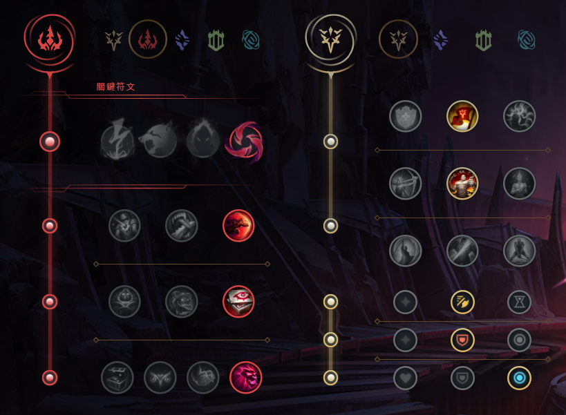
  + ### 召喚師技能
    
  + ### 出門裝
    
  + ### 出裝
    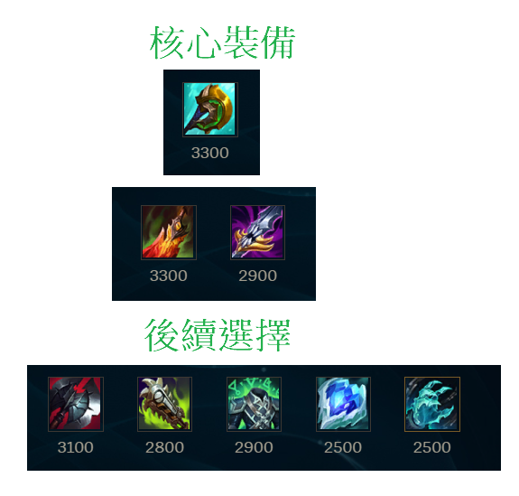
  + ### NOTE
        主Q
        對面肉多副W
        對面脆皮多副E

        最好搭配多個進場英雄，配合Q接控制

        Q按住後會有要衝刺的線
        可以用Q閃
        Q能打到的範圍比實際上的箭頭遠一點

        基本上連招只是把全部的招式按一輪中間穿插A而已
        Q-A-E-A-R-A

+ ## 卡力斯(螳螂、小寒冰)
  + ### 天賦
    
  + ### 召喚師技能
    
  + ### 出門裝
    
  + ### 出裝
    
  + ### NOTE
        主W副Q

        R主要的功能是隱身，進場刺殺後排，然後跳回來
        R在時間內可用兩次
        R可以升級Q、W、E技能
        R升級小招的順序W-E-Q/R

        螳螂是孤立腳色，一旦消失在敵方視野會獲得一次被動
        所以要多進草刷被動
        R可以直接搞隱身+被動

        找機會E/雪球進場，不要正面硬剛

        基本連招
        A-Q

+ ## 赫克林(人馬)
  + ### 天賦
    
  + ### 召喚師技能
    
  + ### 出門裝
    
  + ### 出裝
    
  + ### NOTE
        主Q副E

        進場踢人前，要先把Q的兩層疊好
        可以Q小兵疊層

        E撞到小兵是有用的，所以如果要撞人要注意小兵

        連招
        E-R開團-2層Q

+ ## 柔依(佐伊)
  + ### 天賦
    
  + ### 召喚師技能
    
  + ### 出門裝
    
  + ### 出裝
    
  + ### NOTE
        主Q副E

        Q的飛行距離越遠，攻擊力越高
        Q有兩段，可以直接用Q打人，但那樣傷害最低
        Q用兩段打人會導致飛行距離變長而傷害變高
        第一段Q通常會Q向反方向，在倒數結束前按二段Q，Q人
        要注意Q的飛行距離不能有小兵，要不然會被擋住

        有人要近身，就用E丟他

        基本連招
        Q-Q-R
        利用R的位移增加二段Q飛行的距離
        簡單來說就是先啟動二段Q讓Q飛行，快速按R，讓Q帶到敵人身上
        R做位移後可以順便丟E

        ARAM專屬連招
        雪球-Q-Q-R-雪球
        利用雪球擊中敵人後的二段雪球會飛去敵人邊的效果，搭配R技能會返回原位置的效果打出連招
        注意，雪球只有3秒，所以連招動作要快

+ ## 瑟菈紛(歌姬)
  + ### 天賦
    
  + ### 召喚師技能
    
  + ### 出門裝
    
  + ### 出裝
    
  + ### NOTE
        主Q副W

        被動是第3次的技能就是加強版
        基本上加強版就是給W，W建議只放加強版的
        判斷加強版看小招背景顏色是黃色即可

        E是控制技能，在出冰仗以前可以配合隊友的緩速技能做施放

+ ## 吶兒(小薇恩)
  + ### 天賦
    
  + ### 召喚師技能
    
  + ### 出門裝
    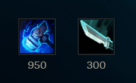
  + ### 出裝
    
  + ### NOTE
        主Q副W

        R的方向是吶兒與鼠標的位置，鼠標在哪就推哪

+ ## 賽恩
  + ### 天賦
    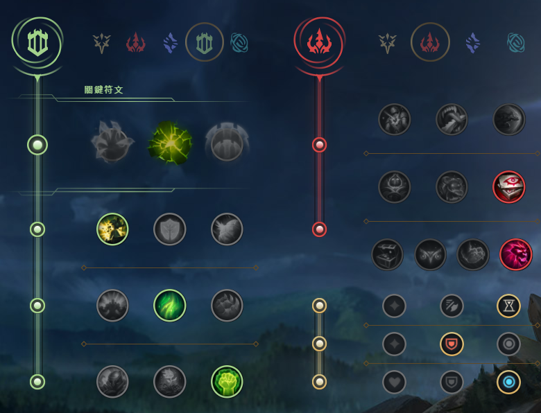
  + ### 召喚師技能
    
  + ### 出門裝
    
  + ### 出裝
    
  + ### NOTE
        主W副Q

        可用草叢Q，也可雪球進場Q

        連招
        雪球-E-雪球 開團
        雪球-E-雪球-W-Q-R
        E是把東西向前丟，此開團方式是先向小兵丟雪球，把用E把雪球擊中的小兵丟出去
        最後雪球回去丟出去的小兵，完成長距離的位移

        R最好直接撞正前方的人，不要遠遠開大來撞，容易撞不到

+ ## 龍獸(龍王)
  + ### 天賦
    
  + ### 召喚師技能
    
  + ### 出門裝
    
  + ### 出裝
    
  + ### NOTE
        主Q副W

        R改手動施法

        Q能跟E一起飛，也就是先Q後，馬上按E用自身飛行帶著Q飛
        二段Q可以讓Q停下來，擊中敵人造成暈眩
        二段E也是可以讓自身停下來
        所以，常見就是Q-E一起飛(也可一起按)，然後碰到敵人一起按Q-E停下，再補下A觸發電刑
        最好先看一下E的最大飛行範圍

+ ## 弗力貝爾(狗熊)
  + ### 天賦
    
  + ### 召喚師技能
    
  + ### 出門裝
    
  + ### 出裝
    
  + ### NOTE
        主W副Q

        R改手動施法

        R只有小圈內才會對敵方造成傷害，大圈只是用來屏蔽防禦塔

        Q、W都能重置普攻

        連招
        E-Q-A-W-A 

+ ## 加里歐(加里奥)
  + ### 天賦
    
  + ### 召喚師技能
    
  + ### 出門裝
    
  + ### 出裝
    
  + ### NOTE
        主W副Q

        W改手動施法

        在草裡E出去撞人，開嘲諷(W)

        連招
        E-W
        雪球-W

+ ## 艾妮維亞(冰鳥、鳳凰)
  + ### 天賦
    
  + ### 召喚師技能
    
  + ### 出門裝
    
  + ### 出裝
    
  + ### NOTE
        輔助
        主Q副E

        傷害
        主E副Q

        冰鳥的一級W就可以把塔旁邊的縫隙填滿了
        冰鳥的W方向是相對於冰鳥的
        如果鼠標點W的位置是冰鳥的正東南西北方，那你就會看到牆是平的
        如果鼠標點W的位置是冰鳥的東北/東南方..之類的，那你就會看到牆是斜的

        連招
        Q-W-Q-E
        先放Q讓其飛行，W馬上擋人去路，再二段Q定人

        R-Q-W-Q-E
        一樣有Q-W二連，主要是先用R來緩慢走位，當然也可以先用Q-W再用R

+ ## 葵恩
  + ### 天賦
    
  + ### 召喚師技能
    
  + ### 出門裝
    
  + ### 出裝
    
  + ### NOTE
        主Q副E

+ ## 姍娜
  + ### 天賦
    
  + ### 召喚師技能
    
  + ### 出門裝
    
  + ### 出裝
    
  + ### NOTE
        主Q副W

+ ## 珍娜(風女)
  + ### 天賦
    
  + ### 召喚師技能
    
  + ### 出門裝
    
  + ### 出裝
    
  + ### NOTE
        主E副Q

        主要是靠E給隊友增加物攻與盾

        Q有兩段，第一段放風，第二段把風吹向當初的鼠標方向
        第二段Q沒按，3秒後也會自動施放

        R除了治療隊友以外還可以擊退敵人

+ ## 凱特琳(女警)
  + ### 天賦
    
  + ### 召喚師技能
    
  + ### 出門裝
    
  + ### 出裝
    
  + ### NOTE
        主Q副W

        連招
        E-Q
        指著敵人E，再按Q

        E-WW-A-Q-A
        往後E的同時，在敵方腳下按WW(要按兩下)，接著A，如果可以再多Q-A

+ ## 威寇茲(大眼)
  + ### 天賦
    
  + ### 召喚師技能
    
  + ### 出門裝
    
  + ### 出裝
    
  + ### NOTE
        主Q副W

        主要是打出被動的傷害

        Q打中敵方能造成緩速

        連招
        W-E
        也可以一起按，基本上只要兩招有中對面，被動就會出來

        W-E-Q-R-W

        注意:R一定要最後按，因為R的期間不能按小招，所以一定要把小招全部按完再按R
        基本上R之前最好至少要打小招到對方身上

+ ## 齊勒斯(泽拉斯)
  + ### 天賦
    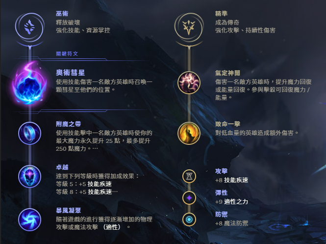
  + ### 召喚師技能
    
  + ### 出門裝
    
  + ### 出裝
    
  + ### NOTE
        主Q副W

        Q改手動施法

+ ## 雷歐娜(女坦、日女)
  + ### 天賦
    
  + ### 召喚師技能
    
  + ### 出門裝
    
  + ### 出裝
    
  + ### NOTE
        主W副E

        E技能等敵方跑遠再交
        除了E之外的小招有啥技能就按啥

        開團R起手，QE捏著打保護

+ ## 埃爾文(翠神、艾翁)
  + ### 天賦
    
  + ### 召喚師技能
    
  + ### 出門裝
    
  + ### 出裝
    
  + ### NOTE
        主E副Q

        Q是禁錮，點一下自己跟隊友都能飛過去
        但隊友是飛到自己對大射程處

        W是種草，在草裡A人會比較痛，不限是不是自己的草

        E為護盾，且爆掉能緩速敵人

        R的小菊對同個英雄攻擊3次會造成AOE擊飛
        召喚小菊後，可以用R+左鍵控制
        小菊使用期間，若有Q中敵人，小菊會立刻飛向被Q中的敵人

        Q-E為主要手段，對己方近戰很有用

+ ## 嘉文四世(皇子)
  + ### 天賦
    
  + ### 召喚師技能
    
  + ### 出門裝
    
  + ### 出裝
    
  + ### NOTE
        主Q副E

        平A輸出也是不低的，要瘋狂平A(被動棒棒)

        連招
        E-Q(皇子靈魂)
        可直接點敵人快速按EQ

        E-Q-W-A-R-A
        R可以不用那麼早用，除非可以關很多人
        不然可以等到敵方想跑時再用

+ ## 妮可
  + ### 天賦
    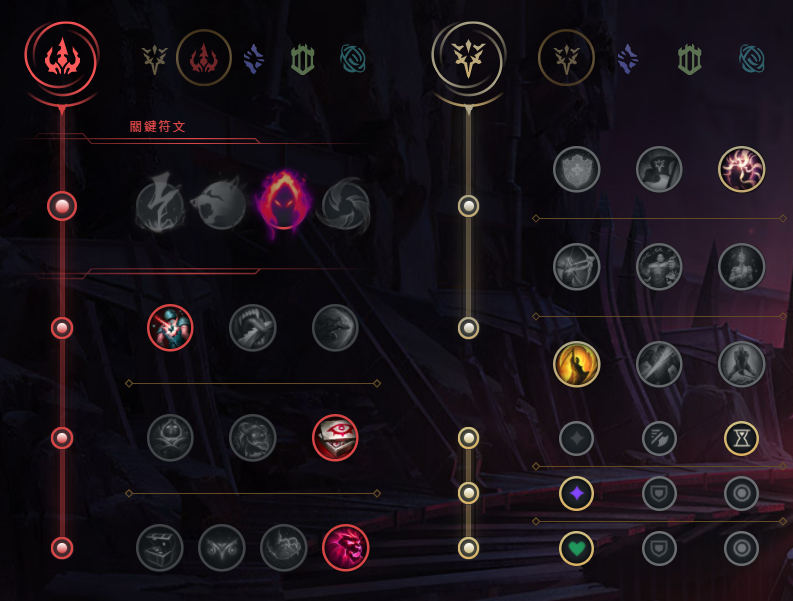
  + ### 召喚師技能
    
  + ### 出門裝
    
  + ### 出裝
    
  + ### NOTE
        主Q副E

        被動是可以偽裝成隊友
        可利用shift+F1~4快速偽裝
        注意:這邊的F1~4是系統給妮可小欄位的順序，不是實際F1~4的順序

        Q: 主力poke手段，若打到敵方英雄或者打死小兵會有續波
        W: 往前的分身，可搭配偽裝詐敵、逃跑、扛塔，被動效果有打三下變痛
        E: 帶有控制的技能，可利用敵方在兵後，E中小兵控制兵後的敵人

        連招
        雪球-R-雪球
        由於R落地有時間差，所以先用雪球擊中敵人，再開R後，雪球過去

        E-Q(簡單的連招)

        A-E-Q(清兵用)
        用平A+E打殘小兵，再用Q清

        雙偽裝
        先用shift+F1偽裝成己方第一個腳色後，按W，再快速shift+F2偽裝成這二個

+ ## 安妮
  + ### 天賦
    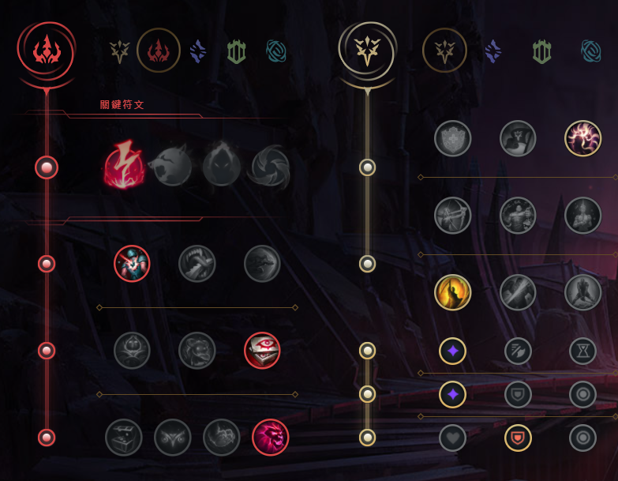
  + ### 召喚師技能
    
  + ### 出門裝
    
  + ### 出裝
    
  + ### NOTE
        主Q副W

        主要是被動的暈眩效果
        比較依賴移速的腳色

        連招
        R-W-Q
        要先弄好被動的暈眩再用

+ ## 剎雅(霞)
  + ### 天賦
    
  + ### 召喚師技能
    
  + ### 出門裝
    
  + ### 出裝
    
  + ### NOTE
        主E副W

        連招
        Q-A-E
        E要定人要至少3根羽毛，所以Q後一定要多A一下

+ ## 伊羅旖(俄洛伊)
  + ### 天賦
    
  + ### 召喚師技能
    
  + ### 出門裝
    
  + ### 出裝
    
  + ### NOTE
        主E副Q

        被動: 附近沒觸手時，會生觸手，所以被動快好，可以提前走去沒觸手的地方
        E: 可以被小兵擋住，就算拉中，能打英雄還是優先打英雄
        盡量利用草叢去E

        連招
        E-Q
        E拉到時，最好靈魂跟本尊一起Q到

        W-E-Q
        W擊殺前面小兵，E後面敵方
        靠W近身敵方再E

        雪球-R-W-E-W-Q
        雪球擊中飛過去，直接開R打連招

        雪球-E-R-W-Q-W(如果團戰允許)
        此連招傷害較高，但如果一進攻對方人都跑了可能R打不到啥人

+ ## 史瓦妮(豬女)
  + ### 天賦
    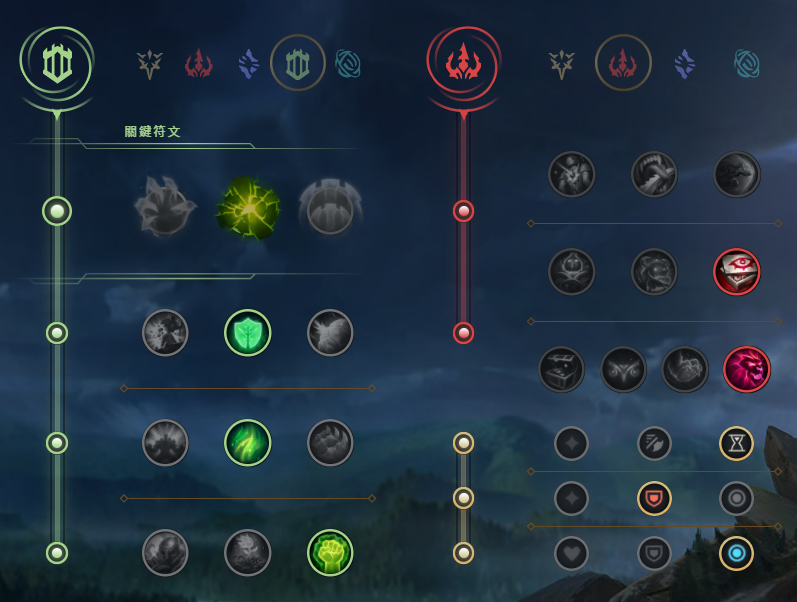
  + ### 召喚師技能
    
  + ### 出門裝
    
  + ### 出裝
    
  + ### NOTE
        主W副Q

        Q: 可以撞人，也可以當純位移
        W: 主要平常時間的消耗，W-A
        E: 看運氣，自己兩次W命中敵方也可以開啟
        R: 主要開團手段，丟出去就丟出去了
        R是沒辦法手動停下的，只有打到首個敵人或者空大兩種

+ ## 鏡爪(千珏)
  + ### 天賦
    
  + ### 召喚師技能
    
  + ### 出門裝
    
  + ### 出裝
    
  + ### NOTE
        主Q副W

        被動標記優先
        1. 近戰的
        2. 回復能力較差的
        3. 看對面的天賦與習慣
        4. 沒啥多段位移能力的

+ ## 路西恩(卢锡安)
  + ### 天賦
    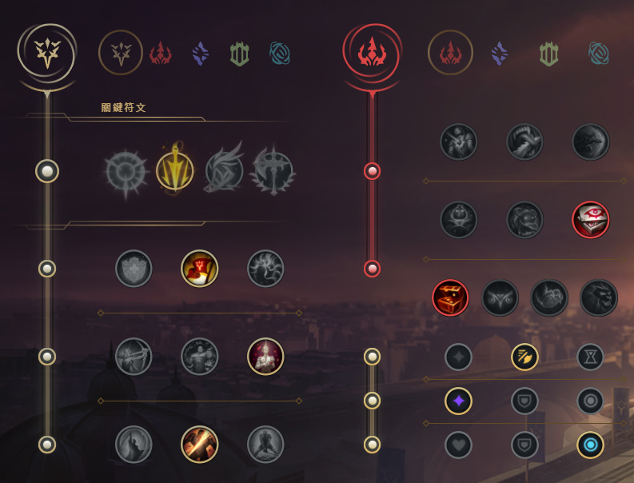
  + ### 召喚師技能
    
  + ### 出門裝
    
  + ### 出裝
    
  + ### NOTE
        主Q副E

        主要是靠被動，讓傷害打滿

        連招
        W-A-E-A-Q-A-R

+ ## 沃維克(狼人)
  + ### 天賦
    
  + ### 召喚師技能
    
  + ### 出門裝
    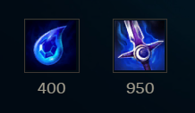
  + ### 出裝
    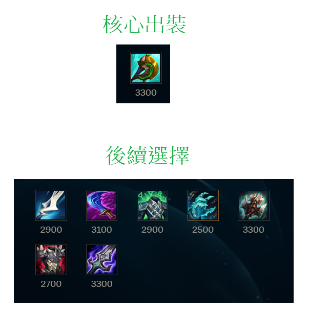
  + ### NOTE
        主Q副E

        Q: 短Q(類似普攻，或小位移+普攻)，長Q(可穿到敵方身後)
        對敵方按久一點的Q就是長Q，是會自動穿到敵方身後的
        W: 釋放時有紅點，代表敵人位置，也可以加移速
        E: 有兩段，第一段降低傷害，第二段恐懼敵方
        E紅色背景就是進入第二段

        連招
        E-Q
        一段E，長Q到敵人後方，時間到會自動二段E

        E-R
        直接恐懼多人

        E-W-R
        利用W的加速快速靠近敵方用R

+ ## 潘森
  + ### 天賦
    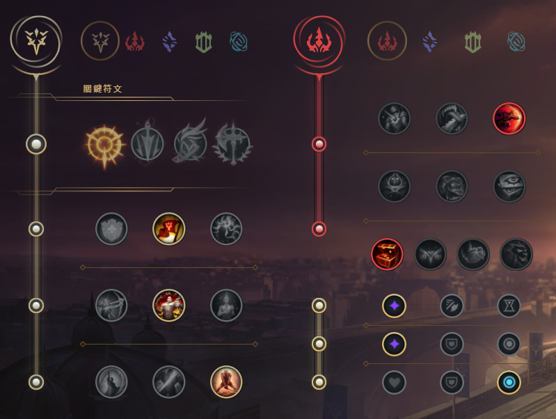
  + ### 召喚師技能
    
  + ### 出門裝
    
  + ### 出裝
    
  + ### NOTE
        主Q副E

        被動是每5次攻擊(普攻/技能)就能得到一次的小招加強
        被動優先給W用

        Q是可以蓄力變長的

        R的範圍內，掃到的都會受到傷害

        連招
        W-Q-A(常用連招)
        紅怒的W起手+Q+A，第二次的紅怒可給Q

        W-Q-A-E(無消耗連招)

+ ## 貪啃奇(塔姆)
  + ### 天賦
    
  + ### 召喚師技能
    
  + ### 出門裝
    
  + ### 出裝
    
  + ### NOTE
        主Q副E

        W技能要預判，最好是放敵方後兩個身位

+ ## 賽特(拳皇、腕豪、瑟提)
  + ### 天賦
    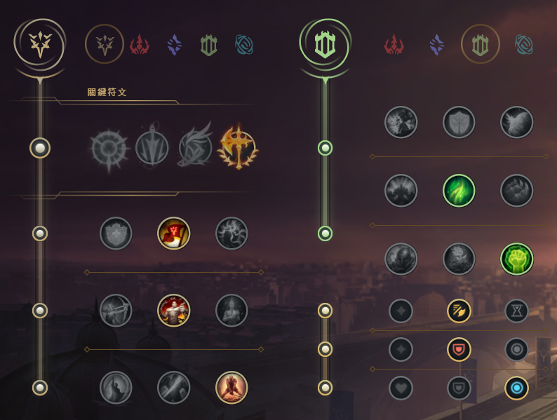
  + ### 召喚師技能
    
  + ### 出門裝
    
  + ### 出裝
    
  + ### NOTE
        主W副Q

        W: 盡量讓敵人吃到中心的傷害
        E: 盡量拉到兩邊的敵人，若僅有一邊有敵人無法造成眩暈
        所以盡量E技能找角度，也可以拉小兵，一側小兵一側敵人也能造成暈眩

+ ## 拉姆斯(龍龜)
  + ### 天賦
    
  + ### 召喚師技能
    
  + ### 出門裝
    
  + ### 出裝
    
  + ### NOTE
        主W副E

        連招
        Q-E-W

+ ## 卡蜜兒(青钢影)
  + ### 天賦
    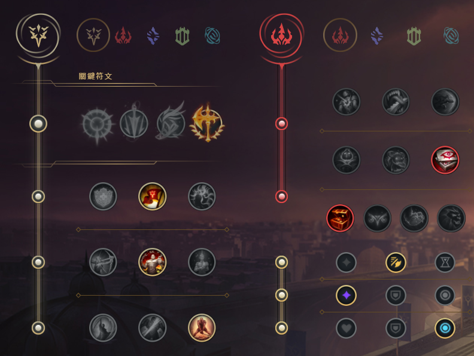
  + ### 召喚師技能
    
  + ### 出門裝
    
  + ### 出裝
    
  + ### NOTE
        主Q副E

        前期非常弱，別衝動
        遊戲在2件套後才開始

        Q: 強化普攻，並給移速
        二段Q(有倒數條的)是主力輸出
        記得二段Q按完還是要A一下，因為Q只是強化，沒A沒效果
        W: 內外圈都能造成傷害，外圈更高
        E: 位移技能，分三段
        第一段: 卡蜜兒鈎牆，此階段可以使用其他技能，此階段也不會受到任何控制
        第二段: 卡蜜兒飛向鈎的牆，此階段就可被控制
        第三段: 卡蜜兒從牆上下來，此階段可以打斷很多英雄的招式
        可以平行牆體放E，就是靠著牆體但平行的位置放E
        主要E的判定在最尾端不是一個點，而是一個圓圈範圍
        R: 有位移，可打斷E技能，可不受小法的E控制

        連招
        Q-A-A-Q-A
        其實就是按Q，增強普攻A第一下，在二段Q過渡期A第二下
        然後，等到二段Q倒數，按二段Q，再A一下
        E-W-E
        W-R

+ ## 關(格溫、靈羅娃娃)
  + ### 天賦
    
  + ### 召喚師技能
    
  + ### 出門裝
    
  + ### 出裝
    
  + ### NOTE
        主Q副

        前期不強，後期強
        跟卡蜜兒一樣兩件套後才開始遊戲

        Q: 疊幾層就會剪幾下，主力輸出，最高疊到4層，中央區域會是真實傷害
        W: 防禦性質
        E: 位移+強化攻擊4秒，時間內只要攻擊命中敵方一次，就能減CD，平A敵方小兵也算
        R: 三段飛針，基本上與W綁定使用，要用R時要有W保護才行，這樣多段R才比較能放得出來

        連招
        Q-E
        不要E-Q啊，至少3層以上再放

        W-R
        安穩放出三段大招

+ ## 逆命(卡牌)
  + ### 天賦
    
  + ### 召喚師技能
    
  + ### 出門裝
    
  + ### 出裝
    
  + ### NOTE
        主W副Q

        此套不要當主C啊，當當工具人，噁心人的

        兩件套後才開始發力

        重點是移動+移動+移動然後噁心人

+ ## 索娜(琴女)
  + ### 天賦
    
  + ### 召喚師技能
    
  + ### 出門裝
    
  + ### 出裝
    
  + ### NOTE
        主Q副W

        基本上，目前非常非常非常不建議玩，debuff太嚴重了

        2022/08/14
        debuff
        造成傷害95%
        治療效果60%
        護盾效果60%
        範圍傷害對小兵造成75%

        所以我放棄人家玩得治療輔助模式，當法師玩
        被動給Q

+ ## 阿姆姆(哭啊、木乃伊)
  + ### 天賦
    
  + ### 召喚師技能
    
  + ### 出門裝
    
  + ### 出裝
    
  + ### NOTE
        主E副Q

        任務是開團，幫隊友吃控制、扛塔、分攤傷害

        Q: 黏人手段，黏到能暈眩敵人，有兩段，用了第一段後，3秒後能用第二段
        所以，一般要先存到2段再上比較好
        W: 使用方式很像死哥的E，自行開關
        E: 對鄰近的敵人造成傷害
        R: AOE傷害，暈眩範圍敵人，盡量跟著雪球或閃現使用
        可以R閃、可以R閃、可以R閃

        連招
        Q-A-R

        Q-R-閃
        Q中前排敵人，往後R閃大到後面的敵人

+ ## 寇格魔(大嘴)
  + ### 天賦
    
  + ### 召喚師技能
    
  + ### 出門裝
    
  + ### 出裝
    
  + ### NOTE
        主W副Q

        走特效流的

+ ## 烏爾加特(戰車)
  + ### 天賦
    
  + ### 召喚師技能
    
  + ### 出門裝
    
  + ### 出裝
    
  + ### NOTE
        主W副E

        P: 每隻腿都有一管炮，該管炮有標記時，用該管炮打會比較痛，一般都是搭配W
        Q: 中距離的單發攻擊，可緩速敵人
        W: 主要輸出手段，搭配被動，啟動時會出現類似劍姬R的感覺，滿級可無限開啟
        E: 位移+翻人+暈眩，位移距離不是很長，基本上位移距離內有碰到敵方英雄才會翻人+暈眩，不然就是單純位移
        衝向小兵可暈眩小兵，但不會翻小兵
        R: 造成敵人傷害+緩速，如果敵方生命值低於斬殺線，就會被拉進鐵處女，並對附近敵人造成恐懼
        R可直接拉敵方英雄不理小兵

+ ## 亞歷斯塔(牛牛、牛頭)
  + ### 天賦
    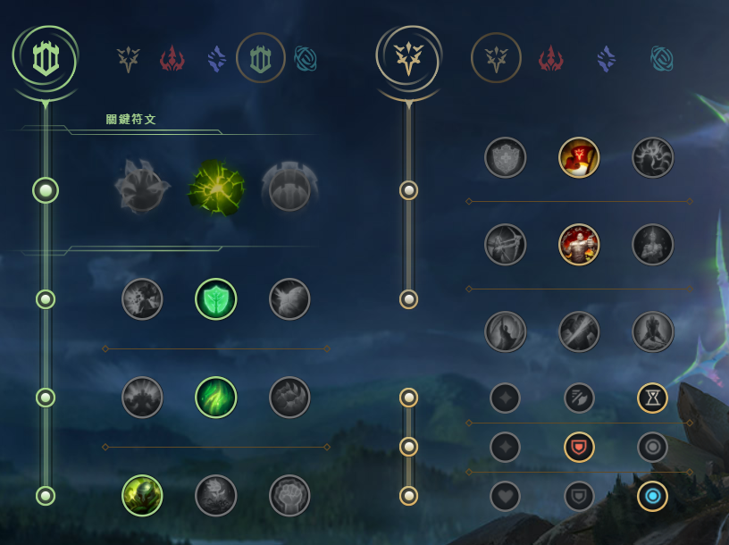
  + ### 召喚師技能
    
  + ### 出門裝
    
  + ### 出裝
    
  + ### NOTE
        主Q副W

        P: 疊滿層數會治癒，基本上可以不理它
        Q: 擊飛敵人
        W: 衝向敵人並擊退
        E: 附近造成衝擊波，疊滿5層下次攻擊會暈敵人(但有時間限制)
        R: 防禦減傷效果

        連招
        W-Q
        Q一定要在W有啟動飛出去的期間再按，鍵盤直接快速按WQ很容易就是只啟動Q
        如果敵人太近就直接用Q就好，有點距離才用此連招
        如果敵方靠牆，可直接用W把敵方往牆上撞就好

        W-Q-E-A
        其實就是在W-Q基礎上，多加E疊層，滿層按A
        盡量繞著敵方附近走疊層

+ ## 辛吉德(跑跑人、煉金)
  + ### 天賦
    
  + ### 召喚師技能
    
  + ### 出門裝
    
  + ### 出裝
    
  + ### NOTE
        主Q副E

        是坦克、坦克、坦克

        P: 在英雄附近(不論友敵)會有2秒移速加成，每位英雄各別計算
        Q: 每秒耗魔每秒造成傷害的煙霧，為主要輸出手段
        W: 丟一團區域黏液，可緩速、束縛敵人
        E: 把敵人往後拋，若敵人因此中了W，就會被定身
        R: 得到多種buff

        主要效果還是開團，要等雪球啊

        連招
        W-雪球-E
        先丟W到敵方腳下，再雪球過去敵方身邊用E把敵方丟到W上

+ ## 煞密拉(沙漠玫瑰)
  + ### 天賦
    
  + ### 召喚師技能
    
  + ### 出門裝
    
  + ### 出裝
    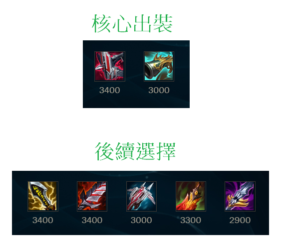
  + ### NOTE
        主Q副E

        P: 分6個等級，E最低、S最高，只要每次的攻擊方式與上次不同就能疊被動
        Q: 離敵人遠就是開槍，離敵人近就是用刀砍
        W: 對周圍區域造成傷害，會造成兩次攻擊，且可以抵擋飛過來的控制技
        E: 小位移的傷害技能，會穿過敵人
        R: 要打滿被動才能用，向周圍射擊+吸血

        玩法是要快點打滿被動，被動沒滿不要輕易進場

        連招
        E-Q
        E過去的過程按Q

        A-W-E-Q-A-R(一秒出被動)
        W是關鍵，進場之前，一定要確保有W，且W一定要蹭到敵方
        先A一下，Q一下，A一下，接著W-E接R，W一定要蹭到敵方，所以不能離太遠

+ ## 拉克絲(拉個屎)
  + ### 天賦
    
  + ### 召喚師技能
    
  + ### 出門裝
    
  + ### 出裝
    
  + ### NOTE
        主E副Q

        P: 用技能會標記敵方，普攻該敵人就會多傷害，R可以消耗標記且再上標記
        Q: 傷害技能並框住前兩個敵方目標(可以是小兵)
        所以也可以Q小兵後面的敵人
        W: 拋出去一個會飛回的護盾，來回途中接觸的隊友都會有
        E: 丟出一塊會緩速敵方的區塊，5秒後會自動爆，也可以手動提早爆
        R: 發出一束傷害閃光

        連招
        Q-E-R-A-E-A
        Q中，接ER，A完印記後，二段E再A印記

        Q-A-E-A
        就是充分利用被動

+ ## 杰西(JC)
  + ### 天賦
    
  + ### 召喚師技能
    
  + ### 出門裝
    
  + ### 出裝
    
  + ### NOTE
        主Q副W

        一般都是用砲型態poke，收割再切槌型態上去
        切槌之前先把砲型態的W開了再切槌型態

        槌型態是近戰，防禦比較高
        砲型態是遠程，幾乎是poke用

        P: 切換武器會增加移速0.75秒
        R: 切換武器型態

        砲型態
        Q: 一個遠程砲，如果通過E的話，傷害會增加
        W: 接下來的三次攻擊獲得最大攻速(2.5)
        E: 用來跳凌波舞的橫桿，通過的Q會加傷害，通過的自己或友軍會加移速

        砲型態
        Q: 跳槌一名敵人，並緩速
        W: 鄰近有個電力場，持續傷害4秒
        E: 擊退目標

        連招
        Q-E(砲型態)
        E要放離自己近的位子，最好在腳下
        Q可以先長按小瞄準一下

        Q-W-A-E(槌型態)
        最好切槌型態之前能用砲型態的W

        砲型態A-Q-E-W-R(槌型態)-Q-W-A-E

+ ## 馬爾札哈
  + ### 天賦
    
  + ### 召喚師技能
    
  + ### 出門裝
    
  + ### 出裝
    
  + ### NOTE
        主E副Q

        P: 一個減傷免控的護盾
        Q: 一個沉默敵人的區塊
        W: 招喚小蟲蟲，用其他招是可以疊蟲量，最多疊兩層，也就是最多一次招三隻蟲蟲
        蟲蟲會優先攻擊E、R的目標
        E: 感染單個敵人，若該敵人死亡，則幻象會散布最靠近的敵人上
        R: AOE傷害，並壓制一位敵人造成傷害2.5秒
        R之前盡量都把小招放完

        連招
        Q-E

        Q-W-E-R-點燃
        點燃可以在R時施放，不會打斷R

+ ## 極靈(時光)
  + ### 天賦
    
  + ### 召喚師技能
    
  + ### 出門裝
    
  + ### 出裝
    
  + ### NOTE
        主Q副W

        連招
        Q-W-Q-A
        就是兩個Q命中同個敵人而造成控制跟傷害

        E-Q-W-E-Q(CD要40以上)
        E都是用讓敵方減速的

+ ## 夜曲(夢靨)
  + ### 天賦
    
  + ### 召喚師技能
    
  + ### 出門裝
    
  + ### 出裝
    
  + ### NOTE
        主Q副E

        基本上用Q消耗
        很吃大招，R衝後排
        永遠不要當第一個進場的英雄

        連招
        A-Q-A

        Q-E-W-A(抓人)

        R-Q
        R快要飛到的途中可以先放Q

+ ## 阿祈爾(R72、沙皇)
  + ### 天賦
    
  + ### 召喚師技能
    
  + ### 出門裝
    
  + ### 出裝
    
  + ### NOTE
        主Q副W

        P: 可以在被摧毀的防禦塔遺址作一個假的防禦塔
        Q: 移動沙兵，途中路過的敵人會受到緩速跟傷害
        W: 製造沙兵，可以代替自己普攻，3個沙兵在場上會加攻速
        盡量手上捏著一個W
        E: 位移到沙兵處+護盾+撞到敵人造成傷害+撞到敵人獲得沙兵充能
        注意: 撞到敵人就會停下來了，所以如果要位移要注意敵人位置
        R: 推人造成傷害，當近戰技能推，因為離敵人太遠推不到
        R的推是從你的滑鼠一側推向另一側的，也就是說，如果你站在兩敵人中間，是可以一起推的

        連招
        W-E(逃生用)

        E-Q-W(飄移)
        對著沙兵按E移動途中，在新的位置按Q，會移動到Q的位置

        雪球-R
        雪球近身，R敵人，或者可以加閃現調整位置推更多人

        W-E-Q-A-R-W-A-A
        先W-E-Q撞到敵方身上，接著AR，在R的落點處放W

+ ## 莉莉亞(小鹿)
  + ### 天賦
    
  + ### 召喚師技能
    
  + ### 出門裝
    
  + ### 出裝
    
  + ### NOTE
        主Q副E

        P: 技能都會造成額外的魔法傷害
        Q: 被動是技能命中能加移速(R除外)，最高疊4層，主動是刮一圈，外圈有額外真傷
        W: 由上往下跳，造成一個圓圈的傷害，圓圈中心有額外傷害
        注意範圍，超過攻擊範圍太多的話，攻擊的圓圈會在攻擊範圍之內
        E: 丟出一顆球球，可以緩速敵人
        注意: 球撞到小兵/障礙物，都會停下來
        R: 讓吃到小招的敵人沉睡，敵人睡醒前打他們會有額外傷害

+ ## 伊瑞莉雅(刀妹)
  + ### 天賦
    
  + ### 召喚師技能
    
  + ### 出門裝
    
  + ### 出裝
    
  + ### NOTE
        主Q副E

        P: 技能命中敵人(敵方小兵也算)可疊層，每層加攻速，滿4層的普攻有額外傷害
        Q: 位移衝向敵方，造成傷害+恢復，若該敵方死亡或不穩會刷新Q，對小兵有額外傷害
        可以利用Q死小兵來接近敵方英雄
        可以先用小兵疊滿層後在Q敵方英雄
        W: 按住可續力，可往前丟刀傷害敵人，傷害會根據續力時間長短有所提升
        PS: 續力時是不能按其他技能的，但可以當防禦技能使用
        E: 丟一把刀在地上，3.5秒內可自己丟第二把，或者3.5秒後刀會落在腳下，兩把刀會朝各自飛去
        若敵人在兩刀之間就會進入不穩、暈眩、傷害
        R: 向前方射出一堆刀片，敵中第一個敵人(英雄限定)會散出千本櫻景嚴，使敵人造成傷害、不穩、緩速

        被動沒滿別輕易上啊

        連招
        E-Q-E
        先在自己身邊放一段E，Q過去敵方立馬按二段E

        雪球-E-雪球-E
        雪球命中敵人後一段E放自己身邊，雪球飛過去按二段E

        E-R-Q-E-A-Q-A-Q-A
        先放一段E在身邊，R-Q過去敵人後立馬二段E暈住後，AQAQA

+ ## 卡瑪(扇子媽)
  + ### 天賦
    
  + ### 召喚師技能
    
  + ### 出門裝
    
  + ### 出裝
    
  + ### NOTE
        主Q副E

        P: 小招命中敵人減少R技能CD 5秒
        一個招擊中一個敵人是減5秒，可擊中多個敵人疊加
        Q: 造成緩速效果的AOE傷害
        W: 鍊狗狗，狗狗兩秒沒掙開就會被定身
        E: 護盾+移速，可給自己或隊友
        R: 強化下一次的小招
        強化Q: 傷害更高且有二段傷害
        強化W: 定身時間延長且會回血
        強化E: 給目標及周圍都上盾跟移速

        連招
        Q-A

        W-E-R-Q-A
        用W+給自己E遛狗，定身後R-Q-A

+ ## 吉茵珂絲(金克絲、暴走蘿莉)
  + ### 天賦
    
  + ### 召喚師技能
    
  + ### 出門裝
    
  + ### 出裝
    
  + ### NOTE
        主Q副W

        近身單挑用機槍型態，遠距離才用炮型態

+ ## 凱能(凱南)
  + ### 天賦
    
  + ### 召喚師技能
    
  + ### 出門裝
    
  + ### 出裝
    
  + ### NOTE
        主Q副W

        P: 技能擊中會有印記，滿3層會暈眩，印記會在敵人身邊環繞小球球
        Q: 丟出一個手裡劍，造成傷害
        W: 對帶有印記的敵人造成傷害，第5下普攻有額外傷害
        E: 加移速+可穿敵+結束增加攻速
        R: 增加防禦，AOE傷害，電滿一定出被動
        開R還是能用其他招的，多用

        連招
        Q-A-W(W滿4層時用)
        滿層的W，標記會是亮的，然後就可以Q-A-W，造成暈眩

        E-R-推推棒
        開E加速後，開R+推推棒希望電多個敵方英雄

        雪球-E-W-Q
        雪球命中上去，開E碰敵人接W-Q

+ ## 麗珊卓(冰女)
  + ### 天賦
    
  + ### 召喚師技能
    
  + ### 出門裝
    
  + ### 出裝
    
  + ### NOTE
        主Q副W

        P: 敵人在附近死亡會變成屍體幫你攻擊，4秒後會自動炸掉
        Q: 射出碎冰緩速及傷害
        W: 定身附近的敵人
        E: 有兩段，一段射出冰爪，會穿過敵人造成傷害，二段會移動到爪子的位置
        R: 可以對自己放也可以放敵人，對敵人放可暈眩，對自己放可回復
        附近的區域都會造成敵人緩速及傷害

        團戰大多靠被動
        在ARAM裡，E技能可以丟向牆外，二段E是會飛到平行位置的

        連招
        E-W
        E位移到敵人附近，放W

        E-W-R
        R放自己

