# 這是LOL中ARAM場的筆記

+ ## 一些建議
  + ### 法師是否出門裝出法球
        主要是看是否需要吃傷害，像烏鴉、血鬼這種就買，若是長手丟丟怪就不需要
  + ### 召喚師技能選擇
    
  + ### 團員構成
        傷害均衡(2AD或3AD)，資源分配合理(發育的英雄不要太多)
        6級前掛機英雄最多2個
        硬控不能太少
  + ### 血包
        血包是回復比例的血值，血會少的當然回血越多，血包跟光圈有差異
        假設滿血為100%，當前生命為x%(0< x < 100)
        光圈回血量為(100 - x) * 16%
        血包+光圈回血量為(100 - x) * 8% + [ 100 - (100 - x) * 8% - x] * 16%
        兩者差距為6.72% * (1 - x%)的最大生命值
  + ### 站位
    **若隊友沒有一開始就出來，就站在一血包的前面一點點就好，如下圖**
    
    + #### 分散(適用於對方有團控的陣容)
          不要和你的主C站在一起，易買一送一
          殘局若一定會死的情況下選擇反跑，避免被敵方利用做進場的跳板
    + #### 抱團(適用於對面針對單體的陣容)          
          靠近你的主C，第一時間準備好控制、虛弱、點燃
          保護主C或幫擋技能 
  + ### 雪球
          有兩段機制
          第一段打中目標才會有第二段
          第二段為位移至命中目標身邊
          傷害為15-100(隨等級提升)的真實傷害

+ ## 漢默丁格(泡麵頭)
  + ### 天賦
    
  + ### 出裝
    
   + ### NOTE
         連招
         EAW 或 EARW

+ ## 布蘭德(火男)
  + ### 天賦
    
  + ### 召喚師技能
    
  + ### 出門裝
    
  + ### 出裝
    
  + ### NOTE
        主E
        E是會擴散的，正確用法是向兵線丟W，再對W到的小兵丟E形成擴散
        要注意E跟R只會擴散鄰近一個的敵人，所以一直線的敵人中丟中間的那位E會比較划算
        W-E-R

+ ## 卡特蓮娜
  + ### 天賦
    
  + ### 出裝
    
  + ### NOTE
        可AD可AP，AD目前強一點，若本團沒AP在出AP

        連招
        Q-E-A，Q丟出刀後，滑鼠指向刀落地點按E，死哥即會飛過去刀的落地點並砍

        E-W-A-Q-E-A，注意，要E到敵人後方

        基本上大絕要配合Q-E進場或者其他方式進場到中央

+ ## 好運姐(女槍)
  + ### 天賦
    
  + ### 出門裝
    
  + ### 出裝
    
  + ### NOTE
        主E副Q
        如果敵方英雄站小兵後面，Q小兵

        E-R連招

+ ## 卡爾瑟斯(死哥)
  + ### 天賦
    
  + ### 召喚師技能
        
  + ### 出裝
    
  + ### NOTE
        主E副Q

        先攻死哥
        一定要讓大招觸發先攻(要注意對方是否人都活著)
        開團，雪球打到小兵或人後，開E飛過去觸發先攻

+ ## 艾希(寒冰)
  + ### 天賦
    
  + ### 出裝
    
  + ### NOTE
        主W副E

+ ## 弗拉迪米爾(吸血鬼)
  + ### 天賦
    
  + ### 召喚師技能
    
  + ### 出門裝
    
  + ### 出裝
    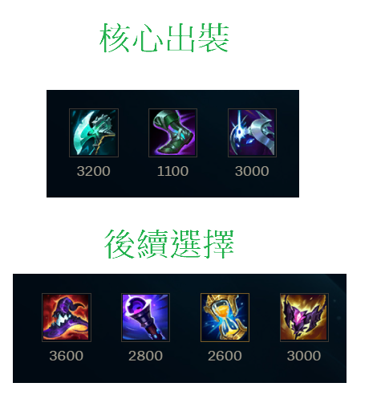
  + ### NOTE        
        E、R技能非智能施法
        Q兵吸血，補兵
        W危機時用，盡量少用
        主E

        連招
        E-W進入敵人中心，可以等E自動時間到施放或者提前按二次E施放
        雪球/閃現進場瞄準人多的地方R-E-W-Q

+ ## 希格斯(炸彈人)
  + ### 天賦
    
  + ### 出裝
    
  + ### NOTE        
        主E副Q

+ ## 葛雷夫(男槍)
  + ### 天賦
    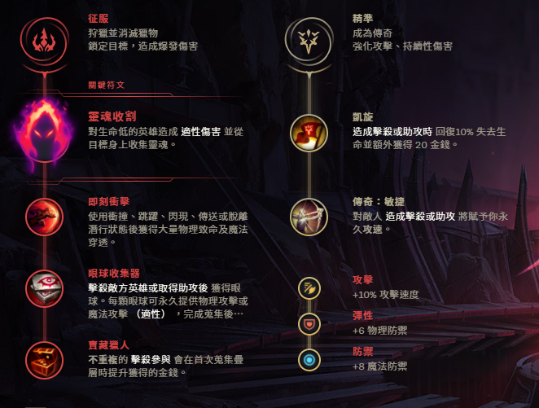
  + ### 召喚師技能
    
  + ### 出門裝
    
  + ### 出裝
    
  + ### NOTE
        換彈的期間E-Q
        Q可以打牆，彈道牆附近敵人造成傷害

        沒牆就用煙霧彈輔助Q的命中

+ ## 阿璃(狐狸)
  + ### 天賦
    
  + ### 出裝
    
  + ### NOTE
        準頭不夠就出永霜
        出招順序
        永霜 -> E

+ ## 科加斯(大蟲子)
  + ### 天賦
    
  + ### 出門裝
    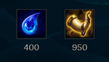
  + ### 出裝
    
  + ### NOTE
        大招可以先吃兵就吃兵疊層數，不一定要等到吃英雄

+ ## 茂凱(大樹)
  + ### 天賦
    
  + ### 出裝
    
  + ### NOTE
        主E副Q
        不要當坦
        盡量往草叢邊緣丟E

+ ## 剛普朗克(船長)
  + ### 天賦
    
  + ### 出門裝
    
  + ### 出裝
    
  + ### NOTE
        6級前主Q
        6級後主E
        用Q搶頭搶砲車
        R改手動施法

        連桶重點不是要刻意去量桶子，而是你跟敵人間的距離
        平A二連桶基本上就是第一個桶子會在自己的腳下，第二個桶子會在敵人的腳下
        所以是要看你跟敵方的距離，你覺得二連桶能不能炸到為主
        然後第二個桶子可以放在第一個桶子的範圍與敵人間的中間點

        二連桶
        13級前 E-A-E-Q
        要先A桶子一下
        然後盡量第一個桶子放自己身邊

        13級後可以EEQ

        3連桶以上是可以在Q桶之後瞬間擺新桶一起爆炸的(連桶爆炸有時間差)，但是要注意桶子的庫存還有手速要快
        2連桶建議確定擺上新桶後瞬間點第一個桶引爆
        2連桶也是可以打第一個桶子再放第二個桶引爆，但手速跟位置要快，不然很容易沒引爆到
        建議還是平A 2連桶
        炸桶子會刷新被動火刀的CD

        連招
        先用火刀A人，炸桶子，再A人跟Q

        Q二連桶(最好在13級後再用)
        第一個桶子要遠離自己，迫使一定要走過去Q，接著等抬手的瞬間在新的位置放桶

+ ## 凱莎
  + ### 天賦
    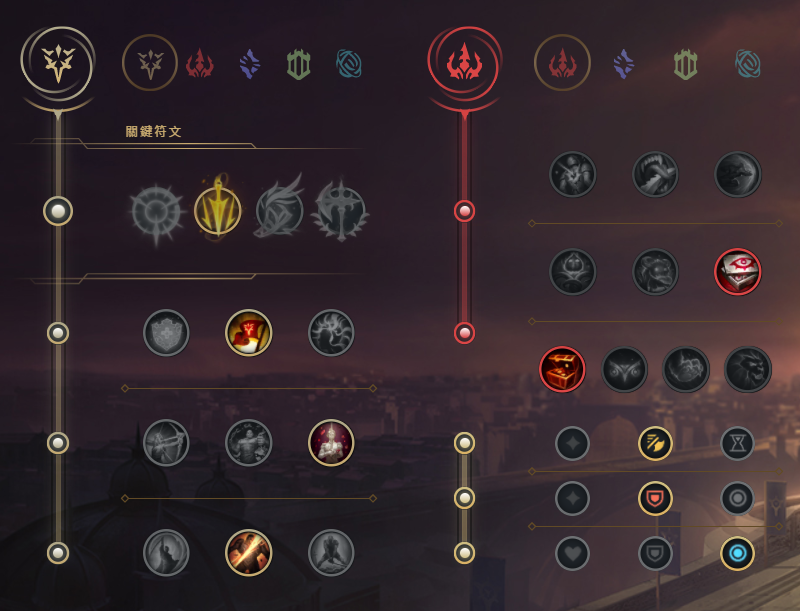
  + ### 出門裝
    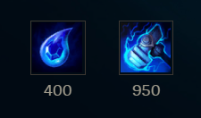
  + ### 出裝
    
  + ### NOTE
        主Q副W

        先合成魔宗進化Q    

+ ## 蓋倫
  + ### 天賦
    
  + ### 出裝
    
  + ### NOTE
    主Q副E

+ ## 易大師(劍聖)
  + ### 天賦
    
  + ### 出裝
    
  + ### NOTE
        主Q副E
        最後一定是這6件裝，只是順序可變
        第一件一定出破敗
        第二件出智慧末刃或死舞，看對面陣容
        第三件出日炎

        連招
        E-Q

+ ## 希瓦娜(龍女)
  + ### 天賦
    
  + ### 召喚師技能
    
  + ### 出門裝
    
  + ### 出裝
    
  + ### NOTE
        ARAM中龍女有多一個被動
        敵方砲車死亡自動加層數
        血包要吃敵方的才會加層數
        主E副W    

+ ## 燼
  + ### 天賦
    
  + ### 出門裝
    
  + ### 出裝
    

+ ## 藍寶
  + ### 天賦
    
  + ### 召喚師技能
    
  + ### 出門裝
    
  + ### 出裝
    
  + ### NOTE  
        主Q 副E
        R改手動施法

        燒到一半按金人還是會繼續燒
        Q在燒人的時候放E不會中斷燒人

        連招
        50度左右WQE，追擊紅溫平A+E

+ ## 魔甘娜
  + ### 天賦
    
  + ### 出裝
    
  + ### NOTE
        主W副Q

+ ## 魔鬥凱薩(鐵男)
  + ### 天賦
    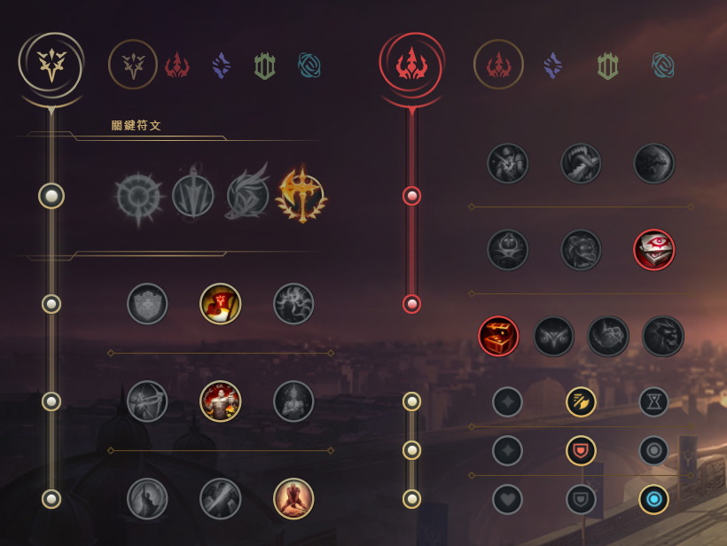
  + ### 召喚師技能
    
  + ### 出裝
    
  + ### NOTE
        抗性裝備也可以考慮出深淵面具
        先E再R鎖地形

+ ## 泰達米爾(蠻王)
  + ### 天賦
    
  + ### 出裝
    

+ ## 伊澤瑞爾(EZ)
  + ### 天賦
    
  + ### 出裝
    

+ ## 斯溫(烏鴉)
  + ### 天賦
    
  + ### 出門裝
    
  + ### 出裝
    
  + ### NOTE
        主要是多多累積被動
        W、E每弄到一名敵方英雄會提供1層
        每一名敵方英雄陣亡會提供1層

        主Q副W

        E-W連招(注意: W有2.5秒才會爆掉，所以二段E不能太急著按)
        先用第一段的E -> 如果有抓住敵人，再敵人離你的路徑中放W(也可放在敵人腳下)
        接著再二次E抓回來讓敵人吃W
        E是彈出去抓，還會彈回來，來回彈到敵人才能將敵人抓回來
        個人覺得等W的眼睛出現再按二段E就好

        回血
        疾跑 + E
        腳下W + 金人

+ ## 達瑞斯(諾手)
  + ### 天賦
    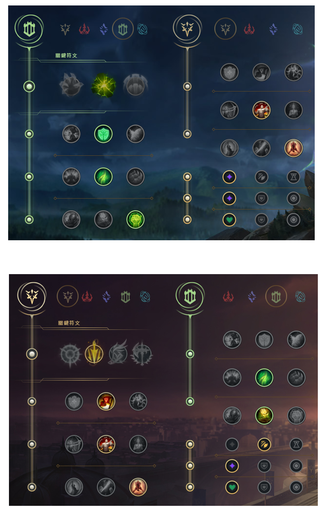
  + ### 召喚師技能
    
  + ### 出門裝
    
  + ### 出裝
    
  + ### NOTE
        需要不斷拉扯，盡量疊好血怒或殘局再出去
        移速、韌性、坦度是達瑞斯在ARAM中最重要的幾個屬性
        Q跟A擊中敵人會疊被動
        被動5層滿
        主Q副E

+ ## 索拉卡(奶媽)
  + ### 天賦
    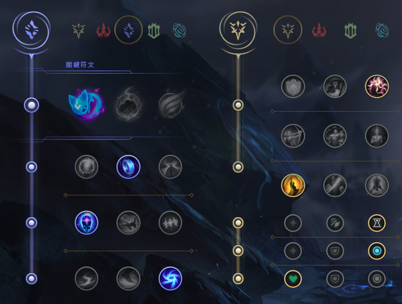
  + ### 出門裝
    
  + ### 出裝
    
  + ### NOTE
        主W副E
        還沒出好戰者之前，不要奶的太激進，盡量賺錢
        E技能主要是防守、封走位、限制突進
        E蠻適合對方刺客雪球到自家C位時，腳下放E

+ ## 維迦(小法)
  + ### 天賦
    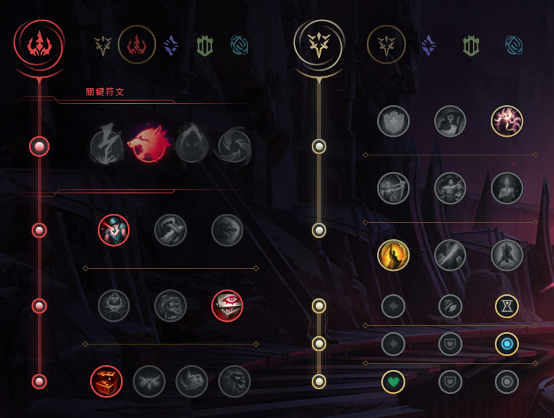
  + ### 召喚師技能
    
  + ### 出門裝
    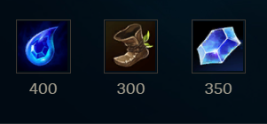
  + ### 出裝
    
  + ### NOTE
        主E副Q

+ ## 塔莉雅(岩雀)
  + ### 天賦
    
  + ### 出門裝
    
  + ### 出裝
    
  + ### NOTE
        主Q副E
        W取消自動施法
        W選擇敵方腳下，按住滑鼠左鍵選擇方向放開
        連招
        W-E-Q(一定要等W開始動作在接EQ)

+ ## 趙信
  + ### 天賦
    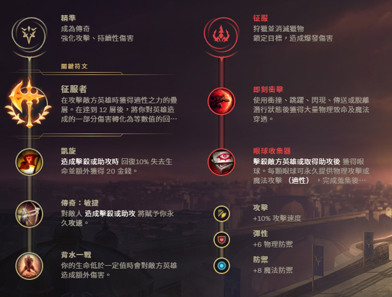
  + ### 召喚師技能
    
  + ### 出門裝
    
  + ### 出裝
    
  + ### NOTE
        積極A兵回血
        主W副Q
        沒有大招只能後上，有大招才有先進場能力
        E-R開團

+ ## 納瑟斯(狗頭)
  + ### 天賦
    
  + ### 召喚師技能
    
  + ### 出門裝
    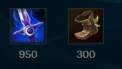
  + ### 出裝
    
  + ### NOTE
        Q兵，Q兵，Q兵
        尤其是砲車
        用雪球丟炮車，搶砲車，搶砲車，搶砲車
        隊友打團，放個E意思意思一下，專心Q兵
        盡量心無雜念專心Q兵疊到200層以後再打人

+ ## 圖奇(老鼠)
  + ### 天賦
    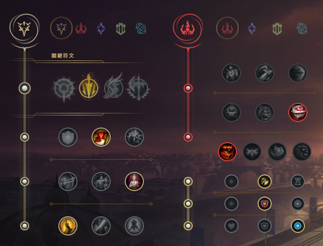
  + ### 召喚師技能
    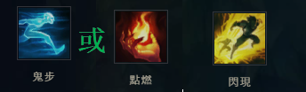
  + ### 出門裝
    
  + ### 出裝
    
  + ### NOTE
        主E副Q
        Q主要是跑去後面偷後排
        潛行者之爪主要是拿來做位移調整位置的

+ ## 費德提克(稻草人)
  + ### 天賦
    
  + ### 召喚師技能
    
  + ### 出門裝
    
  + ### 出裝
    
  + ### NOTE
        不要頂著對面的輸出去吸血
        目前吸血效果被削弱，不要指望

+ ## 犽凝(永恩)
  + ### 天賦
    
  + ### 召喚師技能
    
  + ### 出門裝
    
  + ### 出裝
    
  + ### NOTE
        主Q副E
        非常依賴閃現的英雄
        連招
        EQ閃接R 開團切入
        W閃Q 收拾殘局進行收割
        殘局盡量不要用閃現逃跑
        常見打法
        用Q疊風(Q中敵人兩次後，Q會變成風型態)
        Q打小兵也可以疊
        再打EQ或EQ閃接R

+ ## 黛安娜(皎月)
  + ### 天賦
    
  + ### 召喚師技能
    
  + ### 出門裝
    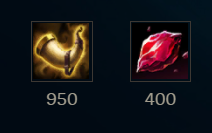
  + ### 出裝
    
  + ### NOTE
        連招
        Q-E會刷新E，QE可以同時按，滑鼠指向敵方同時按QE
        Q-E後穿插A來觸發被動
        可R閃

+ ## 睿娜妲
  + ### 天賦
    
  + ### 召喚師技能
    
  + ### 出門裝
    
  + ### 出裝
    
  + ### NOTE
        給隊友加頓的大號風女、大號露露
        陣容有ADC才適合睿娜妲出場，專養ADC的
        主E副W
        W主要用途是給隊友加攻速跟移速，所以隊友要輸出時就給
        盡量不要只把W當救命技能
        Q在把敵人拉回來的途中如果有撞到其他敵人則會暈眩
        R也可以在ADC輸出時放ADC前面保障ADC的安全

+ ## 貝爾薇斯(虛空女皇)
  + ### 天賦
    
  + ### 召喚師技能
    
  + ### 出門裝
    
  + ### 出裝
    
  + ### NOTE
        主E副Q
        目前還是當坦克玩，沒啥輸出

+ ## 捷莉(澤麗)
  + ### 天賦
    
  + ### 出裝
    
  + ### NOTE
        主W副Q
        E改成手動施法
        W在如果貼著障礙物可穿牆並變大範圍
        ARAM中W是蠻好用的一個招式
        W射障礙物途中不能有敵方小兵或敵人，不然會被阻擋

+ ## 塔隆(男刀)
  + ### 天賦
    
  + ### 召喚師技能
    
  + ### 出門裝
    
  + ### 出裝
    
  + ### NOTE
        主W副Q
        主要就是快速疊滿三層印記打出效果
        先手丟W，等W飛回來後，敵方身上掛兩層被動
        再用Q去打第三層被動

        連招
        W-R-Q-A
        要注意連招的R一定要刮到，這樣才可以到三層被動

+ ## 墨菲特(石頭人)
  + ### 天賦
    
  + ### 出門裝
    
  + ### 出裝
    
  + ### NOTE
        主W副E
        R改手動施法

+ ## 悟空(猴子)
  + ### 天賦
    
  + ### 召喚師技能
    
  + ### 出門裝
    
  + ### 出裝
    
  + ### NOTE
        主Q副E
        玩猴子一定要普攻AAAAA

        連招
        E-Q-R-W-Q-二段R
        雪球-Q-R-W-Q-二段R

+ ## 蒙多醫生
  + ### 天賦
    
  + ### 召喚師技能
    
  + ### 出門裝
    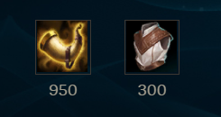
  + ### 出裝
    
  + ### NOTE
        主Q副E
        蒙多醫生是左手丟斧頭，角度要喬一下
        丟斧頭可以只點自己與目標之間的路徑即可
        被動可以抵擋一次控制技能，被動觸發會掉藥劑，記得撿起來
        注意:敵方也可以撿藥劑
        W為爆發傷害，W開啟W關閉，最多4秒，CD長，耗損自身5%生命值
        W要貼敵方臉的時候再用
        E使用時會增加50的攻擊距離

+ ## 薩科(小丑)
  + ### 天賦
    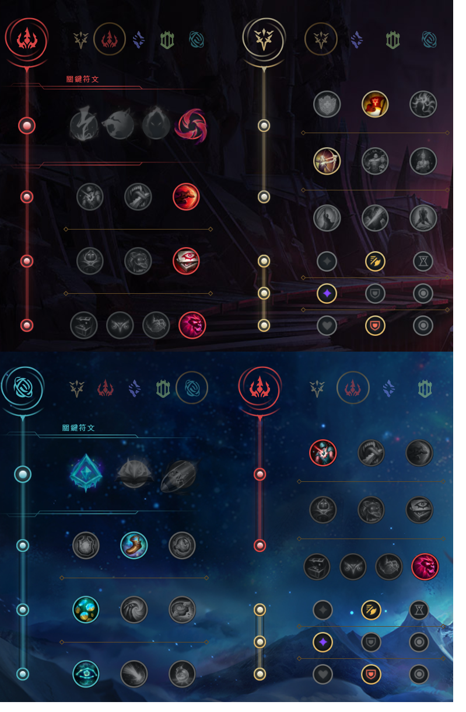
  + ### 召喚師技能
    
  + ### 出裝
    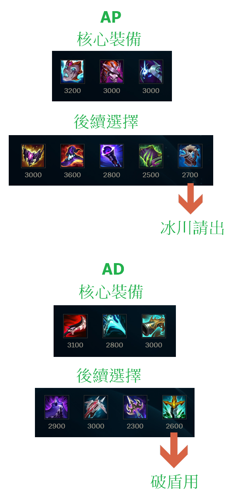
  + ### NOTE
        主E副W
        收割英雄
        很吃裝備，盡量搶人頭
        小丑在釋放大招產生分身的一段時間是無敵的，可躲死哥大
        按住Alt可以操作分身
        E盡量在敵方殘血時用
        盡量利用被刺觸發被動
        E是有點距離投擲式的技能
        可用Q-R進場

+ ## 巴德
  + ### 天賦
    
  + ### 召喚師技能
    
  + ### 出門裝
    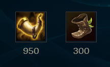
  + ### 出裝
    
  + ### NOTE
        主Q副W
        E、R改手動施法

        Q的如果命中到兩名敵人，或者命中一名彈到牆就會使敵人暈眩

+ ## 凱爾(天使)
  + ### 天賦
    
  + ### 召喚師技能
    
  + ### 出門裝
    
  + ### 出裝
    
  + ### NOTE
        主E副Q
        前期較弱，前中期打sup

+ ## 布里茨(機器人)
  + ### 天賦
    
  + ### 召喚師技能
    
  + ### 出門裝
    
  + ### 出裝
    
  + ### NOTE
        主Q副E
        勾盡量聲東擊西
        機器人是右手出勾，角度喬一下

+ ## 派克
  + ### 天賦
    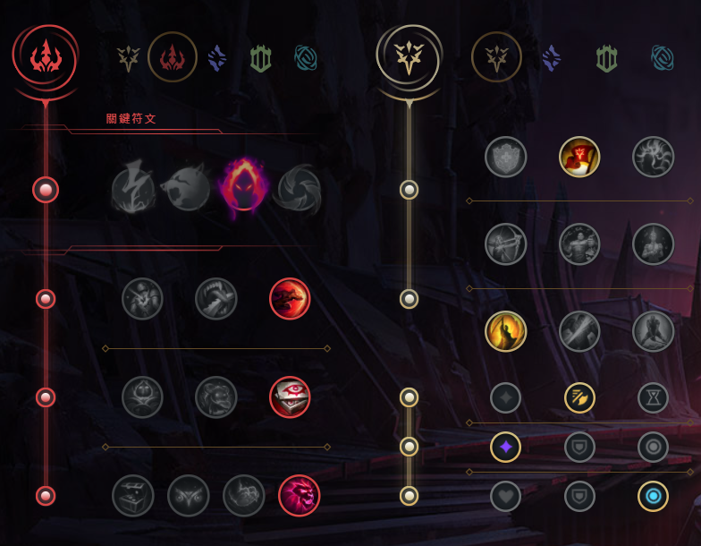
  + ### 召喚師技能
    
  + ### 出門裝
    
  + ### 出裝
    
  + ### NOTE
        主Q副E
        Q取消自動施法
        接技
        Q -> E 二連

        E只要身影回到身上途中有碰到敵人即可暈眩

        派克是收頭角，所以對方殘血再進場

+ ## 厄薩斯(劍魔、234)
  + ### 天賦
    
  + ### 召喚師技能
    
  + ### 出門裝
    
  + ### 出裝
    
  + ### NOTE
        主Q副E
        W技能會被小兵擋住，所以記得要放敵方英雄時注意小兵位置
        Q通常是搭配E一起用的，按Q後在傷害打出來前用E調整位置打
        被動是普攻回血又造成傷害，所以被動最好是A敵方英雄身上

+ ## 鄂爾(山羊)
  + ### 天賦
    
  + ### 召喚師技能
    
  + ### 出門裝
    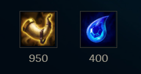
  + ### 出裝
    
  + ### NOTE
        主W副E

        連招
        Q-W
        Q-W-E

+ ## 菲歐拉(劍姬)
  + ### 天賦
    
  + ### 召喚師技能
    
  + ### 出門裝
    
  + ### 出裝
    
  + ### NOTE
        主Q副E

        攻擊手段主要是靠被動的破綻，但不要為了打而打，要看破綻位置
        可以用Q去戳破綻，只要跟破綻一直線Q就能戳到
        例如:破綻在敵人12點鐘方向，你從6點鐘方向Q過去就會剛好打到破綻

        W也可以打破綻，但要正前方，就不能像Q一樣了，因為Q是帶有位移的

        連招
        R-W-A-Q-A
        起手R+W就可以瞬間破一個破綻，然後用走位A與Q能破剩下的

+ ## 波比
  + ### 天賦
    
  + ### 召喚師技能
    
  + ### 出門裝
    
  + ### 出裝
    
  + ### NOTE
        主Q副E

        利用W加速將敵方E牆，也可用閃+E

        E人鼠標要在敵方身上按E，最好是自己、敵方、牆是一直線的情況下E
        R如果只按一下會直接把敵人敲起來，可用來搭配連招，如果R是長按就會增長可把敵人敲飛

        連招
        E-A-Q-A-R-A

