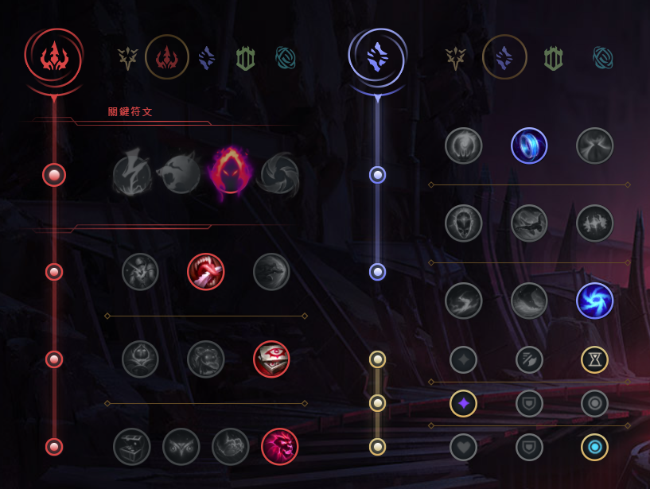
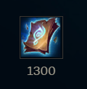
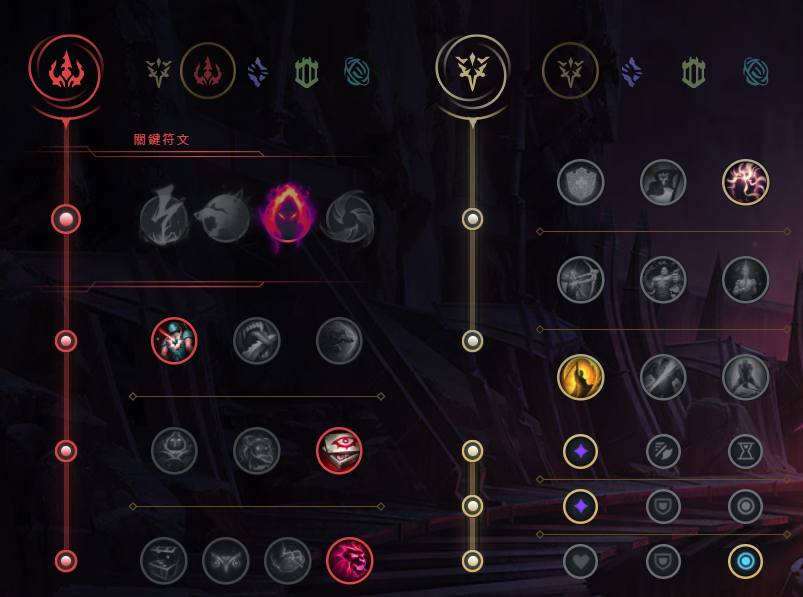
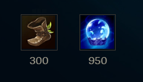
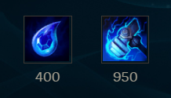
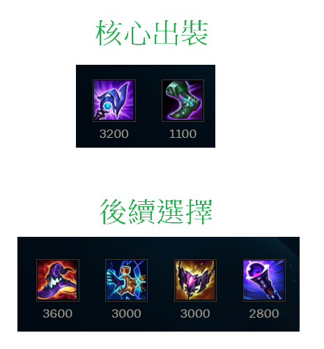
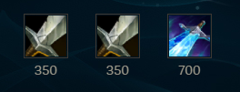
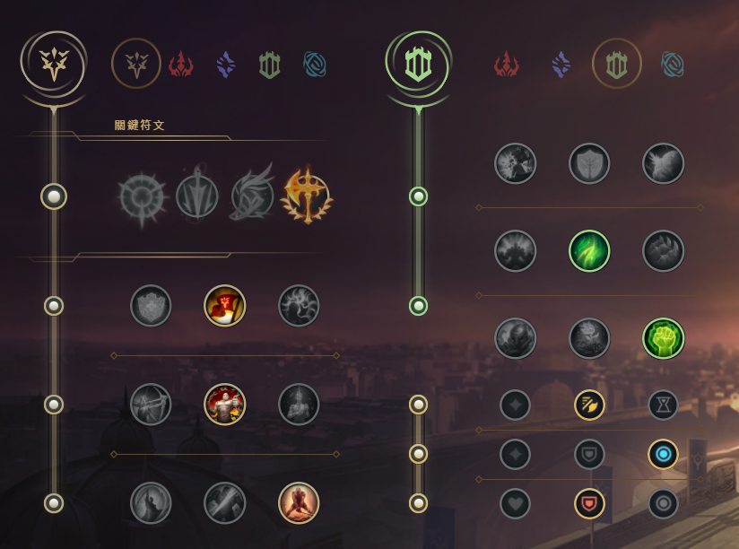
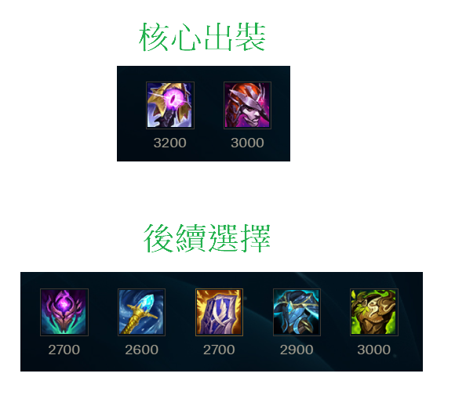
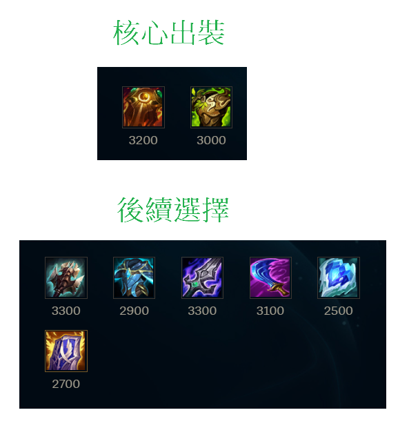

# 這是LOL中ARAM場的筆記

+ ## 漢默丁格(泡麵頭)
  + ### 天賦
    
  + ### 出裝
    
   + ### NOTE
         連招
         EAW 或 EARW

+ ## 布蘭德(火男)
  + ### 天賦
    
  + ### 召喚師技能
    
  + ### 出門裝
    
  + ### 出裝
    
  + ### NOTE
        主E
        E是會擴散的，正確用法是向兵線丟W，再對W到的小兵丟E形成擴散
        要注意E跟R只會擴散鄰近一個的敵人，所以一直線的敵人中丟中間的那位E會比較划算
        W-E-R

+ ## 卡特蓮娜
  + ### 天賦
    
  + ### 出裝
    
  + ### NOTE
        可AD可AP，AD目前強一點，若本團沒AP在出AP

        連招
        Q-E-A，Q丟出刀後，滑鼠指向刀落地點按E，死哥即會飛過去刀的落地點並砍

        E-W-A-Q-E-A，注意，要E到敵人後方

        基本上大絕要配合Q-E進場或者其他方式進場到中央

+ ## 好運姐(女槍)
  + ### 天賦
    
  + ### 出門裝
    
  + ### 出裝
    
  + ### NOTE
        主E副Q
        如果敵方英雄站小兵後面，Q小兵

        E-R連招

+ ## 卡爾瑟斯(死哥)
  + ### 天賦
    
  + ### 出裝
    

+ ## 艾希(寒冰)
  + ### 天賦
    
  + ### 出裝
    
  + ### NOTE
        主W副E

+ ## 弗拉迪米爾(吸血鬼)
  + ### 天賦
    
  + ### 召喚師技能
    
  + ### 出門裝
    
  + ### 出裝
    
  + ### NOTE        
        E、R技能非智能施法
        Q兵吸血，補兵
        W危機時用，盡量少用
        主E

        連招
        E-W進入敵人中心，可以等E自動時間到施放或者提前按二次E施放
        雪球/閃現進場瞄準人多的地方R-E-W-Q

+ ## 希格斯(炸彈人)
  + ### 天賦
    
  + ### 出裝
    
  + ### NOTE        
        主E副Q

+ ## 葛雷夫(男槍)
  + ### 天賦
    
  + ### 召喚師技能
    
  + ### 出門裝
    
  + ### 出裝
    
  + ### NOTE
        換彈的期間E-Q
        Q可以打牆，彈道牆附近敵人造成傷害

        沒牆就用煙霧彈輔助Q的命中

+ ## 阿璃(狐狸)
  + ### 天賦
    
  + ### 出裝
    
  + ### NOTE
        準頭不夠就出永霜
        出招順序
        永霜 -> E

+ ## 科加斯(大蟲子)
  + ### 天賦
    
  + ### 出門裝
    
  + ### 出裝
    
  + ### NOTE
        大招可以先吃兵就吃兵疊層數，不一定要等到吃英雄

+ ## 茂凱(大樹)
  + ### 天賦
    
  + ### 出裝
    
  + ### NOTE
        主E副Q
        不要當坦
        盡量往草叢邊緣丟E

+ ## 剛普朗克(船長)
  + ### 天賦
    
  + ### 出門裝
    
  + ### 出裝
    
  + ### NOTE
        6級前主Q
        6級後主E
        用Q搶頭搶砲車

        二連筒
        13級前 E-A-E-Q
        要先A桶子一下
        然後盡量第一個桶子放自己身邊

        13級後可以EEQ

+ ## 凱莎
  + ### 天賦
    
  + ### 出門裝
    
  + ### 出裝
    
  + ### NOTE
        主Q副W

        先合成魔宗進化Q    

+ ## 蓋倫
  + ### 天賦
    
  + ### 出裝
    
  + ### NOTE
    主Q副E

+ ## 易大師(劍聖)
  + ### 天賦
    
  + ### 出裝
    
  + ### NOTE
        最後一定是這6件裝，只是順序可變
        第一件一定出破敗
        第二件出智慧末刃或死舞，看對面陣容
        第三件出日炎

        連招
        E-Q

+ ## 希瓦娜(龍女)
  + ### 天賦
    
  + ### 召喚師技能
    
  + ### 出門裝
    
  + ### 出裝
    
  + ### NOTE
        ARAM中龍女有多一個被動
        敵方砲車死亡自動加層數
        血包要吃敵方的才會加層數
        主E副W    

+ ## 燼
  + ### 天賦
    
  + ### 出門裝
    
  + ### 出裝
    

+ ## 藍寶
  + ### 天賦
    
  + ### 出門裝
    
  + ### 出裝
    
  + ### NOTE  
        R改手動施法
        主E 副Q
        一套打完

+ ## 魔甘娜
  + ### 天賦
    
  + ### 出裝
    
  + ### NOTE
        主W副Q

+ ## 魔鬥凱薩(鐵男)
  + ### 天賦
    
  + ### 召喚師技能
    
  + ### 出裝
    
  + ### NOTE
        抗性裝備也可以考慮出深淵面具
        先E再R鎖地形

+ ## 泰達米爾(蠻王)
  + ### 天賦
    
  + ### 出裝
    
